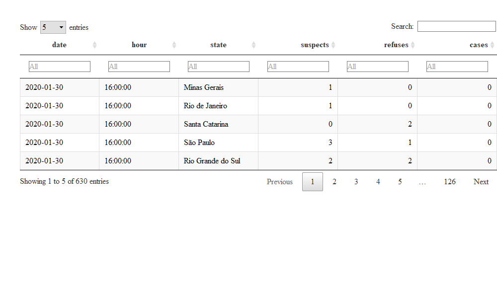
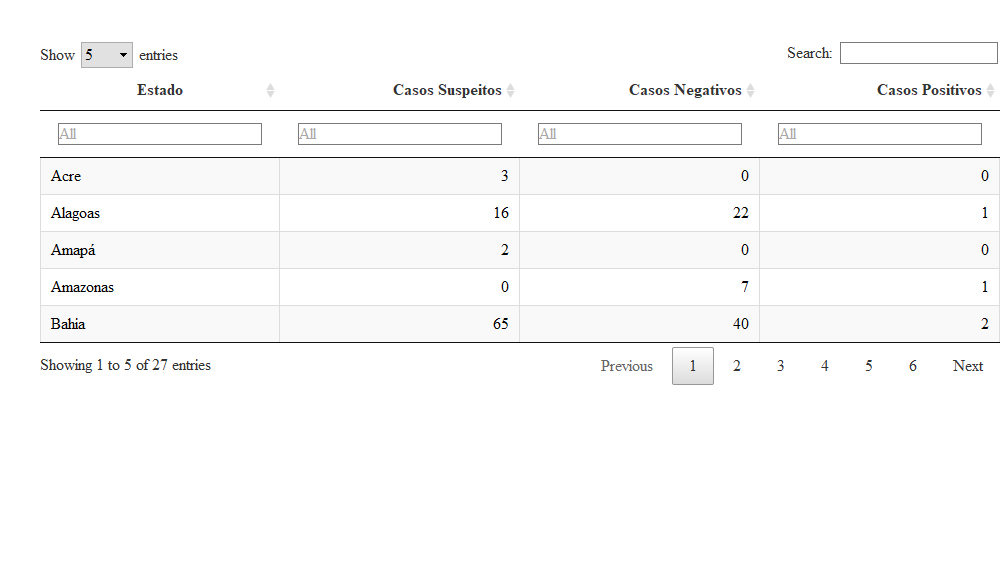

Análise Exploratória dos dados do COVID-19
================
Rafael Barbosa
27 de abril, 2020 às 11:25

  - [0 - Pacotes utilizados](#pacotes-utilizados)
  - [1 - Configurações adicionais](#configurações-adicionais)
  - [2 - Carregando o banco de dados](#carregando-o-banco-de-dados)
  - [3 - Manuseio dos dados (by: Professora
    Terezinha)](#manuseio-dos-dados-by-professora-terezinha)
  - [4 - Análise Exploratória de Dados
    (EDA)](#análise-exploratória-de-dados-eda)

## 0 - Pacotes utilizados

``` r
if(!require(tidyverse)) {
  install.packages("tidyverse", dependencies = T);
  require(tidyverse)
}

if(!require(reshape2)) {
  install.packages("reshape2", dependencies = T);
  require(reshape2)
}

if(!require(DT)) {
  install.packages("DT", dependencies = T);
  require(DT)
}

if(!require(gganimate)) {
  install.packages("gganimate", dependencies = T);
  require(gganimate)
}


if(!require(RColorBrewer)) {
  install.packages("RColorBrewer", dependencies = T);
  require(RColorBrewer)
}

if(!require(gifski)) {
  install.packages("gifski", dependencies = T);
  require(gifski)
}
```

## 1 - Configurações adicionais

A `formato_real_graf` vêm do
[stackoverflow](https://pt.stackoverflow.com/questions/216852/adicionar-nota%C3%A7%C3%A3o-de-moeda-em-r).

``` r
formato_real_graf <- function(values, nsmall = 0) { #- Formatando o valor como moeda
  values %>%
    as.numeric() %>%
    format(nsmall = nsmall, decimal.mark = ",", big.mark = ".") %>%
    str_trim()
}
```

## 2 - Carregando o banco de dados

Os dados estão disponíveis em
<https://www.kaggle.com/unanimad/corona-virus-brazil>.

``` r
banco <- read_csv(file = "brazil_covid19.csv")


banco %>% 
  datatable(class = "cell-border stripe", rownames = F, 
            filter = 'top', 
            options = list(pageLength = 5, autoWidth = TRUE)) %>% 
  formatStyle(1:6, color = "black")
```



## 3 - Manuseio dos dados (by: Professora Terezinha)

### 3.1 - Renomear as colunas

``` r
banco <- 
  banco %>% 
  magrittr::set_colnames(c("Data", "Hora", "Estado", "Casos Suspeitos",
                           "Casos Negativos", "Casos Positivos")) 


banco %>% 
  datatable(class = "cell-border stripe", rownames = F, 
            filter = 'top', 
            options = list(pageLength = 5, autoWidth = TRUE)) %>% 
  formatStyle(columns = 1:6, color = "black")
```


## 4 - Análise Exploratória de Dados (EDA)

### 4.1 - Casos suspeitos, negativos e positivos por estado (16/03)

``` r
banco %>% 
  filter(Data == max(banco$Data)) %>% 
  group_by(Estado) %>% 
  summarise(soma_suspeitos = sum(`Casos Suspeitos`),
            soma_negativos = sum(`Casos Negativos`),
            soma_positivos = sum(`Casos Positivos`))  %>% 
  magrittr::set_colnames(c("Estado", "Casos Suspeitos", "Casos Negativos",
                           "Casos Positivos"))  %>% 
  datatable(class = "cell-border stripe", rownames = F, 
            filter = 'top', 
            options = list(pageLength = 5, autoWidth = TRUE)) %>% 
  formatStyle(columns = 1:4, color = "black")
```


