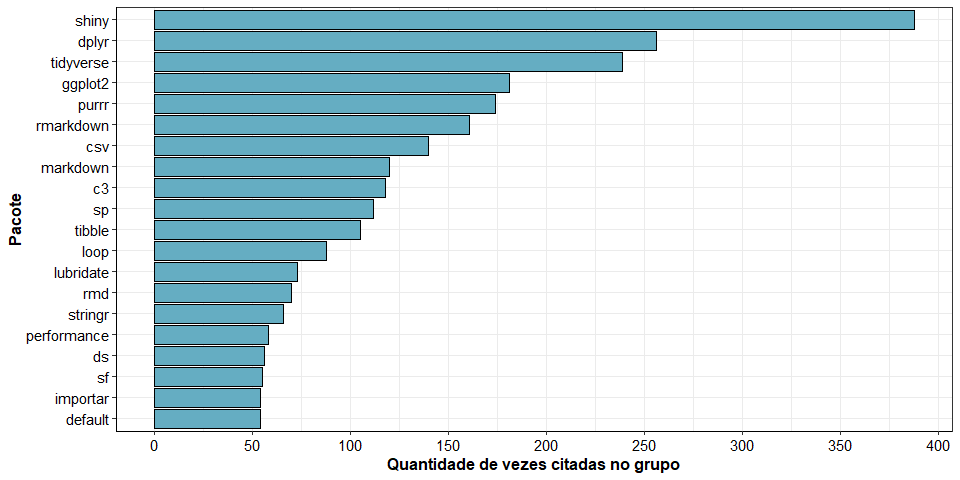

Análise R-Brasil (Telegram)
================
Rafael Barbosa da Silva
06/04/2020

``` r
if(!require(tidyverse)) {
  install.packages("tidyverse", dependencies = T);
  require(tidyverse)
}

if(!require(httr)) {
  install.packages("httr", dependencies = T);
  require(httr)
}

if(!require(rvest)) {
  install.packages("rvest", dependencies = T);
  require(rvest)
}

if(!require(ggthemr)) {
  install.packages("ggthemr", dependencies = T);
  require(ggthemr)
}


ggthemr('fresh')
```

## Carregando os dados

``` r
banco <- read_csv(file = "historico_conversas.csv")
```

    ## Parsed with column specification:
    ## cols(
    ##   data_hora = col_datetime(format = ""),
    ##   nome = col_character(),
    ##   texto = col_character()
    ## )

``` r
banco %>% 
  head
```

    ## # A tibble: 6 x 3
    ##   data_hora           nome          texto                    
    ##   <dttm>              <chr>         <chr>                    
    ## 1 2017-02-05 13:09:14 Felipe Barros Vc trabalha aonde?       
    ## 2 2017-02-05 13:09:38 Tito Conte    Numa consultora ambiental
    ## 3 2017-02-05 13:10:18 Felipe Barros Que al estado?           
    ## 4 2017-02-05 13:10:44 Tito Conte    Sp                       
    ## 5 2017-02-05 13:11:34 Felipe Barros Geógrafo                 
    ## 6 2017-02-05 13:11:53 Tito Conte    Ah bom

## Carregando os pacotes do CRAN em um vetor

``` r
`%!in%` = Negate(`%in%`)

r = getOption("repos")
r["CRAN"] = "http://cran.us.r-project.org"
options(repos = r)

y <- available.packages()

vetor_pacotes <- y[, 1]

vetor_pacotes %>% 
  head
```

    ##         A3      aaSEA     ABACUS     abbyyR        abc   abc.data 
    ##       "A3"    "aaSEA"   "ABACUS"   "abbyyR"      "abc" "abc.data"

## Baixando as stopwords

``` r
banco_palavras <- data.frame(word = tidytext::get_stopwords("pt")[, 1])

banco_palavras %>% 
  head
```

    ##   word
    ## 1   de
    ## 2    a
    ## 3    o
    ## 4  que
    ## 5    e
    ## 6   do

## Criando o primeiro gráfico e retirando algumas stopwords na mão

``` r
banco %>% 
  select(texto) %>%
  tidytext::unnest_tokens(word, texto) %>%
  anti_join(banco_palavras, by = "word") %>%
  filter(word %in% vetor_pacotes) %>%
  count(word, sort = T) %>%
  top_n(30) %>%
  filter(word %!in% c("boa", "usa", "pro", "tbm", "telegram", "list", "rio",
                     "msm", "tutorial", "not", "social")) %>%
  ggplot(data = ., aes(x = reorder(word, n), y = n)) +
  geom_bar(stat = "identity", colour = "black") +
  theme_bw() +
  labs(x = "Pacote", y = "Quantidade de vezes citadas no grupo") +
  theme(legend.position = "bottom",
        axis.title.y = element_text(colour = "black", face = "bold", size = 12),
        axis.title.x = element_text(colour = "black", face = "bold", size = 12),
        axis.text = element_text(colour = "black", size = 11),
        strip.text.x = element_text(size = 12, colour = "white"),
        strip.text.y = element_text(size = 12, colour = "white"),
        legend.title = element_text(size = 16, color = "black", face = "bold"),
        legend.text = element_text(size = 16, color = "black"),
        axis.line = element_line(size = 0.5, colour = "black"),
        plot.caption = element_text(size = 12, color = "black",
                                    vjust = 7),
        plot.subtitle = element_text(size = 12, color = "black"),
        plot.title = element_text(size = 18, face = "bold",
                                  hjust = 0.5, color = "black")) +
  coord_flip() +
  scale_y_continuous(breaks = seq(0, 400, 50))
```

    ## Selecting by n

<!-- -->

## Usuários com mais mensagens (de texto)

``` r
banco %>%
  count(nome, sort = T) %>%
  filter(nome != "Deleted Account")
```

    ## # A tibble: 714 x 2
    ##    nome                      n
    ##    <chr>                 <int>
    ##  1 Marcelo Ventura        3903
    ##  2 Charles Lula da Silva  2772
    ##  3 Leonard de Assis       1684
    ##  4 Sillas                 1669
    ##  5 Julio Trecenti         1343
    ##  6 Fernando Barbalho      1092
    ##  7 Bruna Wundervald        978
    ##  8 Andre Mesquita          843
    ##  9 Rodolfo Silva           763
    ## 10 George Santiago         671
    ## # ... with 704 more rows

## Usuários que mais falaram sobre o pacote `shiny`

``` r
banco %>%
  tidytext::unnest_tokens(word, texto) %>%
  anti_join(banco_palavras, by = "word") %>%
  filter(word == "shiny",
         nome != "Deleted Account") %>%
  count(nome, sort = T)
```

    ## # A tibble: 75 x 2
    ##    nome                           n
    ##    <chr>                      <int>
    ##  1 Henrique Faria de Oliveira    53
    ##  2 Charles Lula da Silva         40
    ##  3 Sillas                        29
    ##  4 José de Jesus Filho           24
    ##  5 Fernando Barbalho             22
    ##  6 Julio Trecenti                16
    ##  7 Vinicius Bodart               14
    ##  8 Gerson Neto                   11
    ##  9 Rubem Dornas                  10
    ## 10 Rodolfo Silva                  9
    ## # ... with 65 more rows

O resto é com vocês. Neste
[link](https://www.curso-r.com/blog/2019-09-10-rbrasil/) tem uma análise
do [Júlio Trecenti](https://github.com/jtrecenti) completinha sobre o
mesmo assunto.
