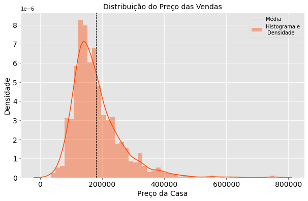
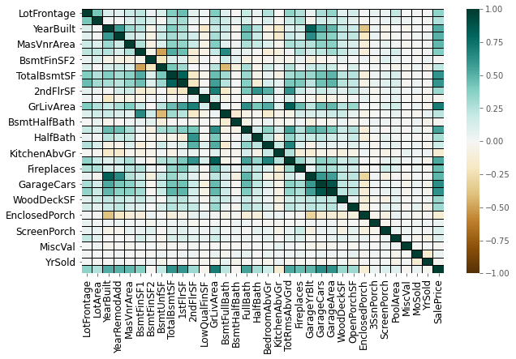
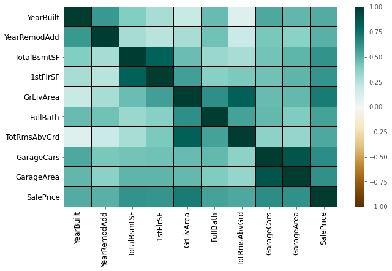
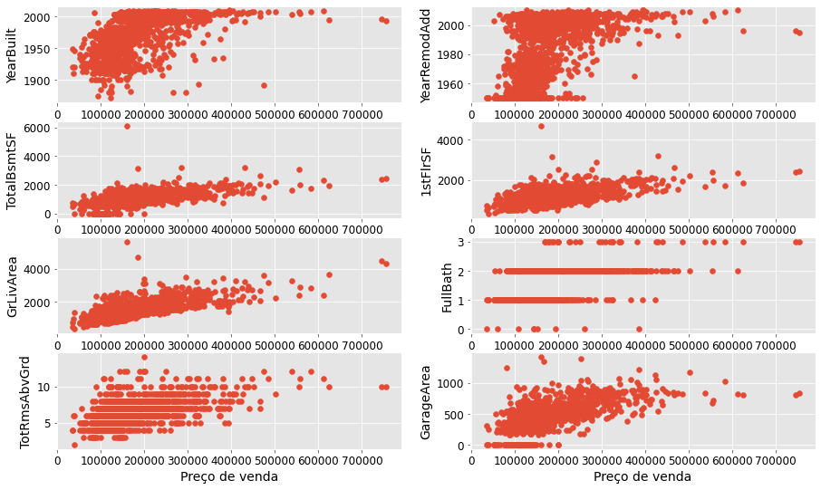

# Apresentação, introdução, iniciação ao problema...

---

Esse é um famoso banco de dados que provém de uma competição do [Kaggle](https://www.kaggle.com/c/house-prices-advanced-regression-techniques). Ele está disponível neste [link](https://www.kaggle.com/c/house-prices-advanced-regression-techniques/data) e tem a seguinte descrição

**Comece aqui se**:

1. Você tem experiência com R ou Python; e
2. Conhece um pouco sobre aprendizado de máquina;

Ideal para uma pessoa que está aprendendo análise de dados em Python (em R eu já estou em um nível relativamente intermediário) e também aprendizado de máquina (igual eu, neste momento). 

## Descrição da competição 

---

Esse é um banco de dados *playground*, justamente para aplicarmos tudo aquilo que aprendemos em análise de dados e previsão. Também menciona a parte que muitas coisas, como o número de banheiros, influencia no valor de uma casa.

O banco de dados possui 79 variáveis explicativas, estas referem aos aspectos residenciais de casas da cidade de Ames em Iowa.

## Objetivo

---

A partir destas 79 variáveis explicativas, isto é, as características das casas, prever o valor de casa. 

## Habilidades que serão praticadas (segundo o Kaggle)

---

1. Criatividade na criação da *feature engineering* (recomendo pesquisar no Google caso não saiba o que é isso); e
2. Para a parte de previsão (aprendizado de máquina): utilização de regressão, random forest, gradient boosting, etc.

## Métrica para verificação dos resultados

---

Será utilizado o Root-Mean-Squared-Error (RMSE), para os mais intimos, a raiz do erro quadrático médio, entre o *log* do valor que o nosso modelo preveu, ou estimou, ($ \hat{y_i} $) e o real valor da casa ($ y $). A fórmula para o RMSE é dada por

$$ RMSE = \sqrt{\frac{1}{n}\sum_{i = 1}^{n} (\hat{y_i} - y_i)^2} $$ 

# Bibliotecas utilizadas

---

- Pandas
- Numpy
- Matplotlib
- Seaborn
- Sklearn


```python
import pandas as pd
import numpy as np
import matplotlib.pyplot as plt
import seaborn as sns
from sklearn.linear_model import LinearRegression


plt.style.use('ggplot')
%matplotlib inline
```

# Carregando os dados com o Pandas

---


```python
treino = pd.read_csv(filepath_or_buffer = "train.csv")
teste = pd.read_csv(filepath_or_buffer = "test.csv")
```

# Explorando os dados

---

## Verificando a estrutura dos dados

Quando baixamos os dados do *Kaggle*, eles vem em um arquivo ZIP com os dados de **treino, teste, a amostra para submissão e um dicionário de cada variável**, mostrando o que significa cada uma e seus respectivos valores. Então, qualquer manuseio, exploração, modificação, etc, será feito nos dados de teste.

Podemos inicialmente verificar como os dados estão organizados, um simples *overview* com o método `.head`.


```python
treino.head()
```


<div>
<style scoped>
    .dataframe tbody tr th:only-of-type {
        vertical-align: middle;
    }

    .dataframe tbody tr th {
        vertical-align: top;
    }

    .dataframe thead th {
        text-align: right;
    }
</style>
<table border="1" class="dataframe">
  <thead>
    <tr style="text-align: right;">
      <th></th>
      <th>Id</th>
      <th>MSSubClass</th>
      <th>MSZoning</th>
      <th>LotFrontage</th>
      <th>LotArea</th>
      <th>Street</th>
      <th>Alley</th>
      <th>LotShape</th>
      <th>LandContour</th>
      <th>Utilities</th>
      <th>...</th>
      <th>PoolArea</th>
      <th>PoolQC</th>
      <th>Fence</th>
      <th>MiscFeature</th>
      <th>MiscVal</th>
      <th>MoSold</th>
      <th>YrSold</th>
      <th>SaleType</th>
      <th>SaleCondition</th>
      <th>SalePrice</th>
    </tr>
  </thead>
  <tbody>
    <tr>
      <th>0</th>
      <td>1</td>
      <td>60</td>
      <td>RL</td>
      <td>65.0</td>
      <td>8450</td>
      <td>Pave</td>
      <td>NaN</td>
      <td>Reg</td>
      <td>Lvl</td>
      <td>AllPub</td>
      <td>...</td>
      <td>0</td>
      <td>NaN</td>
      <td>NaN</td>
      <td>NaN</td>
      <td>0</td>
      <td>2</td>
      <td>2008</td>
      <td>WD</td>
      <td>Normal</td>
      <td>208500</td>
    </tr>
    <tr>
      <th>1</th>
      <td>2</td>
      <td>20</td>
      <td>RL</td>
      <td>80.0</td>
      <td>9600</td>
      <td>Pave</td>
      <td>NaN</td>
      <td>Reg</td>
      <td>Lvl</td>
      <td>AllPub</td>
      <td>...</td>
      <td>0</td>
      <td>NaN</td>
      <td>NaN</td>
      <td>NaN</td>
      <td>0</td>
      <td>5</td>
      <td>2007</td>
      <td>WD</td>
      <td>Normal</td>
      <td>181500</td>
    </tr>
    <tr>
      <th>2</th>
      <td>3</td>
      <td>60</td>
      <td>RL</td>
      <td>68.0</td>
      <td>11250</td>
      <td>Pave</td>
      <td>NaN</td>
      <td>IR1</td>
      <td>Lvl</td>
      <td>AllPub</td>
      <td>...</td>
      <td>0</td>
      <td>NaN</td>
      <td>NaN</td>
      <td>NaN</td>
      <td>0</td>
      <td>9</td>
      <td>2008</td>
      <td>WD</td>
      <td>Normal</td>
      <td>223500</td>
    </tr>
    <tr>
      <th>3</th>
      <td>4</td>
      <td>70</td>
      <td>RL</td>
      <td>60.0</td>
      <td>9550</td>
      <td>Pave</td>
      <td>NaN</td>
      <td>IR1</td>
      <td>Lvl</td>
      <td>AllPub</td>
      <td>...</td>
      <td>0</td>
      <td>NaN</td>
      <td>NaN</td>
      <td>NaN</td>
      <td>0</td>
      <td>2</td>
      <td>2006</td>
      <td>WD</td>
      <td>Abnorml</td>
      <td>140000</td>
    </tr>
    <tr>
      <th>4</th>
      <td>5</td>
      <td>60</td>
      <td>RL</td>
      <td>84.0</td>
      <td>14260</td>
      <td>Pave</td>
      <td>NaN</td>
      <td>IR1</td>
      <td>Lvl</td>
      <td>AllPub</td>
      <td>...</td>
      <td>0</td>
      <td>NaN</td>
      <td>NaN</td>
      <td>NaN</td>
      <td>0</td>
      <td>12</td>
      <td>2008</td>
      <td>WD</td>
      <td>Normal</td>
      <td>250000</td>
    </tr>
  </tbody>
</table>
<p>5 rows × 81 columns</p>
</div>


A partir do método `.head`, verificamos que, aparentemente, os dados estão em um formato ok, entretanto, não conseguimos ver os valores de todas as colunas (variáveis). Logo, podemos utilizar o método `.info` para verificar o formato de cada uma e seus valores. 


```python
treino.info()
```

    <class 'pandas.core.frame.DataFrame'>
    RangeIndex: 1460 entries, 0 to 1459
    Data columns (total 81 columns):
     #   Column         Non-Null Count  Dtype  
    ---  ------         --------------  -----  
     0   Id             1460 non-null   int64  
     1   MSSubClass     1460 non-null   int64  
     2   MSZoning       1460 non-null   object 
     3   LotFrontage    1201 non-null   float64
     4   LotArea        1460 non-null   int64  
     5   Street         1460 non-null   object 
     6   Alley          91 non-null     object 
     7   LotShape       1460 non-null   object 
     8   LandContour    1460 non-null   object 
     9   Utilities      1460 non-null   object 
     10  LotConfig      1460 non-null   object 
     11  LandSlope      1460 non-null   object 
     12  Neighborhood   1460 non-null   object 
     13  Condition1     1460 non-null   object 
     14  Condition2     1460 non-null   object 
     15  BldgType       1460 non-null   object 
     16  HouseStyle     1460 non-null   object 
     17  OverallQual    1460 non-null   int64  
     18  OverallCond    1460 non-null   int64  
     19  YearBuilt      1460 non-null   int64  
     20  YearRemodAdd   1460 non-null   int64  
     21  RoofStyle      1460 non-null   object 
     22  RoofMatl       1460 non-null   object 
     23  Exterior1st    1460 non-null   object 
     24  Exterior2nd    1460 non-null   object 
     25  MasVnrType     1452 non-null   object 
     26  MasVnrArea     1452 non-null   float64
     27  ExterQual      1460 non-null   object 
     28  ExterCond      1460 non-null   object 
     29  Foundation     1460 non-null   object 
     30  BsmtQual       1423 non-null   object 
     31  BsmtCond       1423 non-null   object 
     32  BsmtExposure   1422 non-null   object 
     33  BsmtFinType1   1423 non-null   object 
     34  BsmtFinSF1     1460 non-null   int64  
     35  BsmtFinType2   1422 non-null   object 
     36  BsmtFinSF2     1460 non-null   int64  
     37  BsmtUnfSF      1460 non-null   int64  
     38  TotalBsmtSF    1460 non-null   int64  
     39  Heating        1460 non-null   object 
     40  HeatingQC      1460 non-null   object 
     41  CentralAir     1460 non-null   object 
     42  Electrical     1459 non-null   object 
     43  1stFlrSF       1460 non-null   int64  
     44  2ndFlrSF       1460 non-null   int64  
     45  LowQualFinSF   1460 non-null   int64  
     46  GrLivArea      1460 non-null   int64  
     47  BsmtFullBath   1460 non-null   int64  
     48  BsmtHalfBath   1460 non-null   int64  
     49  FullBath       1460 non-null   int64  
     50  HalfBath       1460 non-null   int64  
     51  BedroomAbvGr   1460 non-null   int64  
     52  KitchenAbvGr   1460 non-null   int64  
     53  KitchenQual    1460 non-null   object 
     54  TotRmsAbvGrd   1460 non-null   int64  
     55  Functional     1460 non-null   object 
     56  Fireplaces     1460 non-null   int64  
     57  FireplaceQu    770 non-null    object 
     58  GarageType     1379 non-null   object 
     59  GarageYrBlt    1379 non-null   float64
     60  GarageFinish   1379 non-null   object 
     61  GarageCars     1460 non-null   int64  
     62  GarageArea     1460 non-null   int64  
     63  GarageQual     1379 non-null   object 
     64  GarageCond     1379 non-null   object 
     65  PavedDrive     1460 non-null   object 
     66  WoodDeckSF     1460 non-null   int64  
     67  OpenPorchSF    1460 non-null   int64  
     68  EnclosedPorch  1460 non-null   int64  
     69  3SsnPorch      1460 non-null   int64  
     70  ScreenPorch    1460 non-null   int64  
     71  PoolArea       1460 non-null   int64  
     72  PoolQC         7 non-null      object 
     73  Fence          281 non-null    object 
     74  MiscFeature    54 non-null     object 
     75  MiscVal        1460 non-null   int64  
     76  MoSold         1460 non-null   int64  
     77  YrSold         1460 non-null   int64  
     78  SaleType       1460 non-null   object 
     79  SaleCondition  1460 non-null   object 
     80  SalePrice      1460 non-null   int64  
    dtypes: float64(3), int64(35), object(43)
    memory usage: 924.0+ KB
    

---

Com essa visualização, podemos confirmar o que foi dito na introdução, que realmente são 79 variáveis explicativas e a última variável (**SalePrice**) é a variável que queremos prever a partir destas. Assim como podemos observar que são muuuuuuuitas variáveis, estas nos trazem informações desde o tipo de moradia, se a residência possui ar condicionado até a condição em que está a garagem da residência.

---

## Explorando a variável SalePrice


Podemos ter `n` ideias aqui, mas, inicialmente, podemos ver como é a distribuição da variável que queremos prever, o Preço de Venda, através de um histograma.

Percebemos que a distribuição do Preço de Vendas possui concentração negativa ou cauda à direita, indicando que os valores predominantes são baixos (para a variável), uma distribuição F de Snedecor caíria bem, talvez. 

**Também podemos notar que:**

- A maior quantidade preços vendidos, isto é, o valor mais frequente do preço de casas está entre \\$ 100.000,00 e  \\$ 150.000,00;

- Também podemos ver casos em que o preço de venda foi \\$ 600.000,00 ou \\$ 700.000,000, entretanto, eles não são tão frequentes, quando comparados com os valores da variável (seriam eles outliers?);

**Nota**: Também é utilizado a densidade da variável, ela é estimada a partir dos dados e o método mais comum para essa estimação é o KDE (Kernel Density Estimation). Um *Kernel* comumente utilizado é o gaussiano.  

---


```python
media_sales_price = treino["SalePrice"].mean()
var_sales_price = treino["SalePrice"].var()

plt.figure(figsize = [10, 6])
sns.distplot(treino["SalePrice"], color = "orangered", hist = True, label = "Histograma e\n Densidade")
plt.axvline(media_sales_price, color = 'k', linestyle = 'dashed', linewidth = 1, label = "Média")
plt.xlabel("Preço da Casa", fontsize = 14, color = "black")
plt.ylabel("Densidade", fontsize = 14, color = "black")
plt.title("Distribuição do Preço das Vendas", fontsize = 14, color = "black")
plt.tick_params(axis = "x", labelsize = 14, labelcolor = "black")
plt.tick_params(axis = "y", labelsize = 14, labelcolor = "black")
plt.legend()
plt.show()
```





---

**Abaixo podemos ver o sumário estatístico da variável Preço de Vendas, podemos afirmar que:**

- Realmente temos 1.460 observações nesta variável;

- O preço médio de venda das casas, assim como já plotada no histograma, é de, aproximadamente, \\$ 180.921,00;

- O desvio padrão do preço de venda das casas é alto, \\$ 79.442,00, indicando que temos alta variabilidade;

- O preço mediano de venda de casas, valor que separa os dados em 50% acima e abaixo da variável, foi de \\$ 163.000,00, indicando que metade dos valores está acima deste valor e a outra metade abaixo;

- O valor máximo de venda de casas foi de \\$ 755.000,00.


---


```python
treino["SalePrice"].describe()
```


    count      1460.000000
    mean     180921.195890
    std       79442.502883
    min       34900.000000
    25%      129975.000000
    50%      163000.000000
    75%      214000.000000
    max      755000.000000
    Name: SalePrice, dtype: float64


---

## Explorando outras variáveis

### Correlação Linear de Pearson (Variáveis Quantitativas)

Uma forma de verificar a relação entre as variáveis X e Y, caso elas sejam quantitativas, é por meio do coeficiente de correlação de Pearson, pois ele mede o grau da correlação linear entre duas variáveis. 

Resumindo, a correlação linear de Pearson pode adotar valores que vão de de -1 a 1. Quanto mais próximo de -1 ou 1, maior é a relação linear entre ambas as variáveis (X e Y) e quanto mais próximo de 0 menor a relação a linear. O sinal (positivo ou negativo) indica uma correlação linear positiva ou negativa entre X e Y.   

![](data:image/png;base64,iVBORw0KGgoAAAANSUhEUgAAAbAAAAB1CAMAAAAYwkSrAAAA+VBMVEX+/v7////i4uKioaLo6Oj+/fz1mpCYocvrAADIzeP19fr86+v+9fMAOJn++PXBx99dcbI4VaW4v9oANZgyUaNrfLfr7fR5iL2Omsb5zMztHRvm6PKcps397+zW2erz8/mvt9bFxcX72dXP0+YhR5/sBxJAW6fwZGP1l5YWQZ3vVVOLi4w3Nzj3s6/0i4dYbbDyd3X4u7r60cvzgYClrtH3q6r2o57wW1fvREJ2hbxRZ675xcL849/tJyvuPDvxa2ebm5spKCnybWSEksLuQD7tLy70kI/uSkwAIJIAK5X1npR0c3SysrNEQ0RXV1cAAAAYFxi9vb5kY2TgRM5MAAAMtklEQVR4nO2cCWPauBaFfdJSjMO+GGKzFWy2DoTVEGygM4Rkmrbz5vX//5h3JZOEzptmWJOoo9PUYpGsa32+V7KkRDmDIiWSJDDBJIEJJglMMElggkkCE0wSmGCSwASTBCaYJDDBJIEJJglMMElggkkCE0wSmGCSwASTBCaYJDDBJIEJJglMMElggkkCE0wSmGCSwATTSwED6WVqPopezvrDge11AnjjTvtVEMNf0q3yI5e90n5UYtcz7qZDgQEBfrc9pizZOD64kp+AZ1RQCVfwUF75LsO6tPJY9vHd/Uf+J4eZ7lujbFa1kTxeyoZxa+sUpWjqvhkbl3dfSnlMN60+kuEHAoPbMlaNKFg6d6jtnfF4EIY7bnU9nLfGrYlXaUW5pXcsQWGwMurECv0+N709MSZt/1LaHvvEaWA0brXqQLSzMsYMK8uL31rjcetdZRydUDY4AyDsHEoM2jJhxauAlkuk40VKL+OZJJCJx4dAMB6/XCJb5sbpfpKcWok8w5Djb82rdDqr+2ZQoSB9U8ykEzmNrihr1UIIZbRpPBOfxsq54pR8EldloFo9wPDDgOFOdSoX9T4cSt35bQCdsXs7Rm/mdm14as91w32Vk4qqFAJRMOr9itOlV/U6+3RhtCtto8uvfmQzFDcDNFoXrovwrHVRadhUGIsx3REXra5bubDR7ZJX2i7dG8aBPgYtHQ8VhxloictQMZdKohQZDlNFJHJJq4xsJhSrIp7nxuUTzF+CzWExdGkSlk9FeluMZKvVq4jJrkSx8sl0DrFUjnKkNQRrZnmJWFqJhax8TM9nkCBWxYhO90PmpYARkj5z9YCnUgMiumrgpgvXQG+OglrwCBXQtzkw53q+bnrKTyVnMw/oqXQAK82AzewK0CBgC5ZpcMuz4j4v6g3gwghU6Ky9GX2zuj6wF8Ty0o962SlLyxFNS5molZGIIZtFNsc+5cCgpGsxam6C6ce7q1qWXtSW7C2V5sCq5JNKc8g+usziKsNexNJ0aJIPE7Ah1bK8Asx02tzf8MOAjVZ+H+PwFM4cN2O3tUBv5XZn8Oxud+FxYAgY/bmLqO2uI373pkGesvB9iycYLUbEnwGbd7sDzHr3XcCg4yyYT/rA0HJwPaJgettfHeRiRCHpdyvNmN/kMa05HEaKqHEPW06z2eAa2DAeqgHD2tp6s0n/YPq+ZRJldrLcMD0MNdlYAzFLKTZZjPWBhTgwLVKkHwKcy2dfCpgz8YE1Wn4vtMLNtfouQB5mdAsEzBk5BR9Ye4LeLcXF9VCD/C+qFlC/4eU6Cw6sTpG1T71T47Y9asMgp63Yq5af9/zBw+huYE6GlYu5e5D1mhXi1SuRKu9PE0nNqtWoSWs1i/wpGy8PkxwYkK4iQR50uQa2XLKfYqTEyulrYNlcGUmLn7HY1KBnU7nvgGGZLZOT6ZFSqanvbfhhwFy/f/JTcpgFOjcED72Wa4Qp1IXXIRGYG6ph93F95w+/OrZtGzdoXPOR1MpZA8NIrd+HxNsOBVmvTU5Lee3OIzDM2FeubdhG67AeeJrzrfFTM0UeYBJEJELTPAFb3odEJJtW04oj5vsPdIveWprme2bZYqMJxWLhskguxEb9PMaGIuZ3wEyLxdWcRcq9EDBc14lGz8OkRWwc8p9OB5MOc6ZB6wEYtbE7KxTCnTHarLMrjKJqv1AgymGVRnuBLsH1gZEnqp01MJf3i+MOVLdQ6NOpHoA5rOe7vQsXCnb/IPNDKWrA0pBSGhqatQwNOkohGhYkQjo53QMwcrlhSTdZrMzQNZe1YLykl+iLIINUpW5L8YFRkqnRkCRJ512G6A7QN4HRl2kFpWaopIeaP3yK+ycdOEoMt9S5TbEtOlbn6oxGIIMBhbAeDTow75yrpEqfDqu5Q4YXCKijzuaq05iwtpjcwLumcpNzf5TI/AW9Lm6ohMG4zG7VMd5dr/1tfEPAVAJWGPs+TY56e5j55aaVSBGXJEuz1Jq/68glQAExliplm5HUJS7pGKf2BRui6NPI1LLMT1XmP5805CLpdMQfRiopDgzZVMJqEv9yqhahUWKTcn4iYLk4AQsRfN/5asGXAUYGVnouD4der89GdIUCNeh5lLqc6HngnBSInvOEZT4nj4s6v3nsBaNNuah8Zf10HPa5efSCROcKu+y7h7y89DnLwutgnwbOD7KeurFQjA8ceEovdLoSU9OJj14q6bpegq7zhCEx2ZfTIeXyH8JYrlistG5Bfd0gZiyk8QgbYw92lBXsdBovUwJ7w+rbuxM7eGrqcTZi40n+L1MTj3mo5b3O6PHt5pzi/ZTB/XzDw3nuiz6+2fj0qNYrm9Xez3Rg01yzaD3ObXxv/v+fcm3gUQ1/7slfhB0n/Mx1HlEIBQ+ZpjiCnn22fuOeFFEvbr1cDxNMEphgksAEkwQmmCQwwSSBCaa9gX33fPh4XD9qHs2+v6tX+ct2ia3r23gQfzjHxhPzyfQ3bYV922pfYIiGw+EAm5KqsAn7QDgM0IF9yA6nun62AyTwMPkQ8JshwCatWLrVGe6nH9azGiWdl917MnabKjVNK/FZqyKf19fYVBWXwg671bw3sJVtqBV4c3ulOkBbVY2Kqxq2vejTcXIyYHPDVr22rV6z7QTtHmtrR7XVcZRunZuna+WLJBmkLYvNvCLOZ5qmEYstkiBzQmJIWFakiGLCSkSGQDnStEyyxWpehaj2+DMBm7t0q4ftRgAVe4R2C506WIL+nC/sn0ZYuYEoVRMYsLWY2xbbj2NUAtFRAegaT1eL5BSaAqvKFq0QYsv9mhXUlCJbW4mUTwisFmJTwM0hW9ksoxzHMkPc6H+sBuwYjfcH1va8AFusZEsdjJQzZguXBGzled7pPKxXKPDaWE2tSR9Ru++HyMJsMfonYCW9BKuoNInVdBkH8pfrriS7TJ+u40WtbJpK7n6TRzKOIAMWZ8B0c8f9HXsDm8xmqrdo8KUPtdCbzVeVtYcZM+N0IXHCQmJvdmtcAK1erw6PL3qzfQY33uzJRkfSYiExMU1Qc1UTSJu48pel6O5X4snTAZum000zw9c59VQpadUSxTUwy7KeLSResO0xfPdMRQ20F+MR61TWIfF0175i/tRetNqgah1H9QoqXxmj6HwzMnpPA+P+lA7W2EJyphy/Yhsz2BfITcvZ2gk9jC14Zvk+hGJESWYv6eZYe9jzjRLZBhj0adwB1BfUhGx/zfMAo/tiEVY9dBd3zqKL1oDFQ8VpOXedJz2b9WEExzKXVzCtfH7Y1KtsmyBM6sryw0ToZGGB92HVlMlulCzKWT1i4tmBzVx/hDZozCc0DKhTTxZG+xa4sLvdzsmunVWL9hg9o8J2jJB/FWYtp6MW+K1jPLWNCknmRKDGSpQzQbbmn0UwkstP83lqO5SnJzM6ze4F5CPLfOJSY6ONpEXJJQuJ2asdNwvsDay3XtBvdHp0tZ5LI44KT87bvfaToekQ8Wr92tr8jnErCLQ7De+cj/D7F08BM/kmp2QJZpIO1J/Q8LAYXJYVtk0AWvlUI3vwbQgKqyvGHJoCZLIIMwRmSHJHxz5gpmOdPEwfbP5iwZ4n3bLadTXr99/vQfhHkx/nFzZ3Apx0afKYbbU7sJdecv0ZtUOb7gqMhmMH7QWU+huhVN0a2W7AgOid0ZDAjizokUxxS2Q7AUO4MZvN7hB4xdqvyV5YejphZYpbodgJWGCgzuar3+7evV796Jf8UMwFX69yiVrCqm01SbVjSCx0DMPBa9YPTX/NKlnWNLRdTNxx0EGPqoN3sg87sqBvi2uPYf0J107+xdp+XL/Hg7Pk9ZKSm3AEkwQmmCQwwSSBCSYJTDD91MAEvbYnzf6pgYk5sfj0g+42wPBeSKzQ3ohotoIPEphQksAE03GAiSjty0tbsJ+OAOzDGxH18fNLW7CfjgDs/VsRdfbxpS3YTzIkCiY56BBLEphgOgKwM0GBvRfRbAVfDgUm6mZfQc3+F88l/oySwATTTw1M1Jj4lLYFJuK1Y9e/gfFK9GRbbwcM+CyeK+LD169PjpBfqfD2jyes3m6UGPj8H+GA4f0fwFfhzKaHqF+/Hgzs1ze/CHfl+PAGePNROLPP/vxyEDA+u6XhV/GAff4v8EW4mEhtffbLAcDw9uzsLSGTwJ5LOBDYxz//pIsWEdiHLyKGRBYUDwF2/2f3BQT2/hvwh4DTiQcCW59EvFGigm/fvn0Wzmo+TDwCsPfiPYPip1xl+JlnOsQ0+igzHVKvRhKYYJLABJMEJpgkMMEkgQkmCUwwSWCCSQITTBKYYJLABJMEJpgkMMEkgQkmCUwwSWCCSQITTBKYYBLz183/vVLen0mJpP8B12NObOdGE0EAAAAASUVORK5CYII=)


O que podemos fazer, já que temos mais de uma variável preditora, é fazer uma matriz ou um gráfico de correlação.


**Para mais informações sobre a correlação linear de Pearson, visite:** 

- http://www.inf.ufsc.br/~vera.carmo/Correlacao/Correlacao_Pearson_Spearman_Kendall.pdf
- https://operdata.com.br/blog/coeficientes-de-correlacao/
- http://www.leg.ufpr.br/~silvia/CE701/node79.html


Abaixo, podemos observar a matriz de correlação em formato de gráfico, pois, em vez de ver uma tabela imensa que nem cabe no Jupyter, o gráfico também é mais intuitivo dado a legenda e a as cores. 

Apesar de que a matriz de correlação, pelo *default* vai selecionar somente as variáveis numéricas, entretanto, algumas variáveis que foram categorizadas, isto é, transformadas de qualitativas para quantitativas, como a **MSSubClass**, aparecem. Logo, devemos retirar estas variáveis, já que não é através da Correlação de Pearson que verificamos uma relação linear entre variável qualitativa e quantitativa.

Assim como a **MSSubClass**, as variáveis retiradas foram: 

- Id;
- OverallQual; e
- OverallCond.

---


```python
var_quant = treino._get_numeric_data()
var_quant = var_quant.drop(["Id", "MSSubClass", "OverallQual", "OverallCond"], axis = 1)

var_quant.head()
```


<div>
<style scoped>
    .dataframe tbody tr th:only-of-type {
        vertical-align: middle;
    }

    .dataframe tbody tr th {
        vertical-align: top;
    }

    .dataframe thead th {
        text-align: right;
    }
</style>
<table border="1" class="dataframe">
  <thead>
    <tr style="text-align: right;">
      <th></th>
      <th>LotFrontage</th>
      <th>LotArea</th>
      <th>YearBuilt</th>
      <th>YearRemodAdd</th>
      <th>MasVnrArea</th>
      <th>BsmtFinSF1</th>
      <th>BsmtFinSF2</th>
      <th>BsmtUnfSF</th>
      <th>TotalBsmtSF</th>
      <th>1stFlrSF</th>
      <th>...</th>
      <th>WoodDeckSF</th>
      <th>OpenPorchSF</th>
      <th>EnclosedPorch</th>
      <th>3SsnPorch</th>
      <th>ScreenPorch</th>
      <th>PoolArea</th>
      <th>MiscVal</th>
      <th>MoSold</th>
      <th>YrSold</th>
      <th>SalePrice</th>
    </tr>
  </thead>
  <tbody>
    <tr>
      <th>0</th>
      <td>65.0</td>
      <td>8450</td>
      <td>2003</td>
      <td>2003</td>
      <td>196.0</td>
      <td>706</td>
      <td>0</td>
      <td>150</td>
      <td>856</td>
      <td>856</td>
      <td>...</td>
      <td>0</td>
      <td>61</td>
      <td>0</td>
      <td>0</td>
      <td>0</td>
      <td>0</td>
      <td>0</td>
      <td>2</td>
      <td>2008</td>
      <td>208500</td>
    </tr>
    <tr>
      <th>1</th>
      <td>80.0</td>
      <td>9600</td>
      <td>1976</td>
      <td>1976</td>
      <td>0.0</td>
      <td>978</td>
      <td>0</td>
      <td>284</td>
      <td>1262</td>
      <td>1262</td>
      <td>...</td>
      <td>298</td>
      <td>0</td>
      <td>0</td>
      <td>0</td>
      <td>0</td>
      <td>0</td>
      <td>0</td>
      <td>5</td>
      <td>2007</td>
      <td>181500</td>
    </tr>
    <tr>
      <th>2</th>
      <td>68.0</td>
      <td>11250</td>
      <td>2001</td>
      <td>2002</td>
      <td>162.0</td>
      <td>486</td>
      <td>0</td>
      <td>434</td>
      <td>920</td>
      <td>920</td>
      <td>...</td>
      <td>0</td>
      <td>42</td>
      <td>0</td>
      <td>0</td>
      <td>0</td>
      <td>0</td>
      <td>0</td>
      <td>9</td>
      <td>2008</td>
      <td>223500</td>
    </tr>
    <tr>
      <th>3</th>
      <td>60.0</td>
      <td>9550</td>
      <td>1915</td>
      <td>1970</td>
      <td>0.0</td>
      <td>216</td>
      <td>0</td>
      <td>540</td>
      <td>756</td>
      <td>961</td>
      <td>...</td>
      <td>0</td>
      <td>35</td>
      <td>272</td>
      <td>0</td>
      <td>0</td>
      <td>0</td>
      <td>0</td>
      <td>2</td>
      <td>2006</td>
      <td>140000</td>
    </tr>
    <tr>
      <th>4</th>
      <td>84.0</td>
      <td>14260</td>
      <td>2000</td>
      <td>2000</td>
      <td>350.0</td>
      <td>655</td>
      <td>0</td>
      <td>490</td>
      <td>1145</td>
      <td>1145</td>
      <td>...</td>
      <td>192</td>
      <td>84</td>
      <td>0</td>
      <td>0</td>
      <td>0</td>
      <td>0</td>
      <td>0</td>
      <td>12</td>
      <td>2008</td>
      <td>250000</td>
    </tr>
  </tbody>
</table>
<p>5 rows × 34 columns</p>
</div>


```python
corr_var_quant = var_quant.corr()

plt.figure(figsize = [10, 6])
sns.heatmap(data = corr_var_quant, vmin = -1, vmax = 1, linewidths = 0.01, linecolor = "black", cmap = "BrBG")
plt.xlabel("", fontsize = 14, color = "black")
plt.ylabel("", fontsize = 14, color = "black")
plt.tick_params(axis = "x", labelsize = 12, labelcolor = "black")
plt.tick_params(axis = "y", labelsize = 12, labelcolor = "black")
plt.show()
```





---

**Observando** o gráfico de correlação podemos notar que:

- A visualização está relativamente dificultada, pois no eixo Y não estão todas as variáveis;

- Muitas variáveis não possuem correlação linear ou possuem fraca correlação, como a **PoolArea, MiscVal, MoSold e YrSold**;

- São poucas as variáveis que possuem forte correlação linear com a SalePrice (a partir de agora é melhor falar o exato nome da variável)

---


```python
corr_var_quant["SalePrice"].round(2)
```


    LotFrontage      0.35
    LotArea          0.26
    YearBuilt        0.52
    YearRemodAdd     0.51
    MasVnrArea       0.48
    BsmtFinSF1       0.39
    BsmtFinSF2      -0.01
    BsmtUnfSF        0.21
    TotalBsmtSF      0.61
    1stFlrSF         0.61
    2ndFlrSF         0.32
    LowQualFinSF    -0.03
    GrLivArea        0.71
    BsmtFullBath     0.23
    BsmtHalfBath    -0.02
    FullBath         0.56
    HalfBath         0.28
    BedroomAbvGr     0.17
    KitchenAbvGr    -0.14
    TotRmsAbvGrd     0.53
    Fireplaces       0.47
    GarageYrBlt      0.49
    GarageCars       0.64
    GarageArea       0.62
    WoodDeckSF       0.32
    OpenPorchSF      0.32
    EnclosedPorch   -0.13
    3SsnPorch        0.04
    ScreenPorch      0.11
    PoolArea         0.09
    MiscVal         -0.02
    MoSold           0.05
    YrSold          -0.03
    SalePrice        1.00
    Name: SalePrice, dtype: float64


---

**Observando** valores maiores que 0.5 ou menor que -0.5, temos as variáveis mais correlacionadas linearmente com a SalePrice:
       
     - YearBuilt;
     - YearRemodAdd;
     - TotalBsmtSF;
     - 1stFlrSF;
     - GrLivArea;
     - FullBath; 
     - TotRmsAbvGrd;
     - GarageCars;
     - GarageArea.
     
Podemos agora verificar a correlação especificamente entre as nossas variáveis do novo conjunto de dados.

---


```python
novo_banco = treino[["YearBuilt", "YearRemodAdd", "TotalBsmtSF", "1stFlrSF", "GrLivArea", "FullBath", "TotRmsAbvGrd", "GarageCars", "GarageArea", "SalePrice"]]
corr_novo_banco = novo_banco.corr()

plt.figure(figsize = [10, 6])
sns.heatmap(data = corr_novo_banco, vmin = -1, vmax = 1, linewidths = 0.01, linecolor = "black", cmap = "BrBG")
plt.xlabel("", fontsize = 14, color = "black")
plt.ylabel("", fontsize = 14, color = "black")
plt.tick_params(axis = "x", labelsize = 12, labelcolor = "black")
plt.tick_params(axis = "y", labelsize = 12, labelcolor = "black")
plt.show()
```





---

Podemos observar que a **GarageCars** e **GarageArea** apresentaram forte correlação, assim como podemos confirmar abaixo.

---


```python
corr_novo_banco["GarageCars"].round(2)
```


    YearBuilt       0.54
    YearRemodAdd    0.42
    TotalBsmtSF     0.43
    1stFlrSF        0.44
    GrLivArea       0.47
    FullBath        0.47
    TotRmsAbvGrd    0.36
    GarageCars      1.00
    GarageArea      0.88
    SalePrice       0.64
    Name: GarageCars, dtype: float64


---

Segundo a descrição do banco de dados, o que é cada variável:

- GarageCars: Tamanho da garagem em capacidade de carros

- GarageArea: Tamanho da garagem em pés quadrados (unidade de área dos Estados Unidos)

Como elas possuem forte correlação entre si, o ideal é que seja escolhida somente uma, neste caso, iremos escolher a GarageArea, pois apresentar mais logicamente uma medida de área. Assim, podemos excluir a variável GarageCars do banco de dados atual `novo_banco`.

---


```python
novo_banco = novo_banco.drop(["GarageCars"], axis = 1)

novo_banco.head()
```


<div>
<style scoped>
    .dataframe tbody tr th:only-of-type {
        vertical-align: middle;
    }

    .dataframe tbody tr th {
        vertical-align: top;
    }

    .dataframe thead th {
        text-align: right;
    }
</style>
<table border="1" class="dataframe">
  <thead>
    <tr style="text-align: right;">
      <th></th>
      <th>YearBuilt</th>
      <th>YearRemodAdd</th>
      <th>TotalBsmtSF</th>
      <th>1stFlrSF</th>
      <th>GrLivArea</th>
      <th>FullBath</th>
      <th>TotRmsAbvGrd</th>
      <th>GarageArea</th>
      <th>SalePrice</th>
    </tr>
  </thead>
  <tbody>
    <tr>
      <th>0</th>
      <td>2003</td>
      <td>2003</td>
      <td>856</td>
      <td>856</td>
      <td>1710</td>
      <td>2</td>
      <td>8</td>
      <td>548</td>
      <td>208500</td>
    </tr>
    <tr>
      <th>1</th>
      <td>1976</td>
      <td>1976</td>
      <td>1262</td>
      <td>1262</td>
      <td>1262</td>
      <td>2</td>
      <td>6</td>
      <td>460</td>
      <td>181500</td>
    </tr>
    <tr>
      <th>2</th>
      <td>2001</td>
      <td>2002</td>
      <td>920</td>
      <td>920</td>
      <td>1786</td>
      <td>2</td>
      <td>6</td>
      <td>608</td>
      <td>223500</td>
    </tr>
    <tr>
      <th>3</th>
      <td>1915</td>
      <td>1970</td>
      <td>756</td>
      <td>961</td>
      <td>1717</td>
      <td>1</td>
      <td>7</td>
      <td>642</td>
      <td>140000</td>
    </tr>
    <tr>
      <th>4</th>
      <td>2000</td>
      <td>2000</td>
      <td>1145</td>
      <td>1145</td>
      <td>2198</td>
      <td>2</td>
      <td>9</td>
      <td>836</td>
      <td>250000</td>
    </tr>
  </tbody>
</table>
</div>


---

Podemos também, verificar a relação linear individual entre as variáveis preditoras e a variável `SalePrice` (Y, dependente, target, etc), através de um `scatterplot`.

---


```python
plt.figure(figsize = [15, 9])

plt.subplot(4, 2, 1)

plt.scatter(treino["SalePrice"], treino["YearBuilt"])
plt.xlabel("Preço de venda", fontsize = 14, color = "black")
plt.ylabel("YearBuilt", fontsize = 14, color = "black")
plt.tick_params(axis = "x", labelsize = 12, labelcolor = "black")
plt.tick_params(axis = "y", labelsize = 12, labelcolor = "black")

plt.subplot(4, 2, 2)


plt.scatter(treino["SalePrice"], treino["YearRemodAdd"])
plt.xlabel("Preço de venda", fontsize = 14, color = "black")
plt.ylabel("YearRemodAdd", fontsize = 14, color = "black")
plt.tick_params(axis = "x", labelsize = 12, labelcolor = "black")
plt.tick_params(axis = "y", labelsize = 12, labelcolor = "black")


plt.subplot(4, 2, 3)


plt.scatter(treino["SalePrice"], treino["TotalBsmtSF"])
plt.xlabel("Preço de venda", fontsize = 14, color = "black")
plt.ylabel("TotalBsmtSF", fontsize = 14, color = "black")
plt.tick_params(axis = "x", labelsize = 12, labelcolor = "black")
plt.tick_params(axis = "y", labelsize = 12, labelcolor = "black")


plt.subplot(4, 2, 4)

plt.scatter(treino["SalePrice"], treino["1stFlrSF"])
plt.xlabel("Preço de venda", fontsize = 14, color = "black")
plt.ylabel("1stFlrSF", fontsize = 14, color = "black")
plt.tick_params(axis = "x", labelsize = 12, labelcolor = "black")
plt.tick_params(axis = "y", labelsize = 12, labelcolor = "black")


plt.subplot(4, 2, 5)

plt.scatter(treino["SalePrice"], treino["GrLivArea"])
plt.xlabel("Preço de venda", fontsize = 14, color = "black")
plt.ylabel("GrLivArea", fontsize = 14, color = "black")
plt.tick_params(axis = "x", labelsize = 12, labelcolor = "black")
plt.tick_params(axis = "y", labelsize = 12, labelcolor = "black")


plt.subplot(4, 2, 6)

plt.scatter(treino["SalePrice"], treino["FullBath"])
plt.xlabel("Preço de venda", fontsize = 14, color = "black")
plt.ylabel("FullBath", fontsize = 14, color = "black")
plt.tick_params(axis = "x", labelsize = 12, labelcolor = "black")
plt.tick_params(axis = "y", labelsize = 12, labelcolor = "black")


plt.subplot(4, 2, 7)

plt.scatter(treino["SalePrice"], treino["TotRmsAbvGrd"])
plt.xlabel("Preço de venda", fontsize = 14, color = "black")
plt.ylabel("TotRmsAbvGrd", fontsize = 14, color = "black")
plt.tick_params(axis = "x", labelsize = 12, labelcolor = "black")
plt.tick_params(axis = "y", labelsize = 12, labelcolor = "black")


plt.subplot(4, 2, 8)

plt.scatter(treino["SalePrice"], treino["GarageArea"])
plt.xlabel("Preço de venda", fontsize = 14, color = "black")
plt.ylabel("GarageArea", fontsize = 14, color = "black")
plt.tick_params(axis = "x", labelsize = 12, labelcolor = "black")
plt.tick_params(axis = "y", labelsize = 12, labelcolor = "black")


plt.show()
```





---

Podemos notar que as variáveis **GrLivArea, 1stFlrSF e TotalBsmtSF** possuem uma relação linear aparente com o **Preço de Venda**, confirmando com o que foi dito e concluído através da Correlação Linear de Pearson. **Entretanto**, não podemos nos esquecer das variáveis qualitativas (sejam elas nominais e ordinais).

---

### Explorando as variáveis qualitativas

Lembrando das variáveis qualitativas que estão codificadas em número, na qual retiramos na análise de correlação, elas são:

- MSSubClass 
- OverallQual
- OverallCond

Um jeito para selecionarmos, inicialmente, somente as variáveis qualitativas é através do método `.select_dtypes` e incluir somente o tipo de variável `object`. Logo após, podemos fazer um `join`, somente com as variáveis que retiramos que estão listadas acima. 


```python
var_qualit = treino.select_dtypes(include = "object")

var_qualit.head()
```


<div>
<style scoped>
    .dataframe tbody tr th:only-of-type {
        vertical-align: middle;
    }

    .dataframe tbody tr th {
        vertical-align: top;
    }

    .dataframe thead th {
        text-align: right;
    }
</style>
<table border="1" class="dataframe">
  <thead>
    <tr style="text-align: right;">
      <th></th>
      <th>MSZoning</th>
      <th>Street</th>
      <th>Alley</th>
      <th>LotShape</th>
      <th>LandContour</th>
      <th>Utilities</th>
      <th>LotConfig</th>
      <th>LandSlope</th>
      <th>Neighborhood</th>
      <th>Condition1</th>
      <th>...</th>
      <th>GarageType</th>
      <th>GarageFinish</th>
      <th>GarageQual</th>
      <th>GarageCond</th>
      <th>PavedDrive</th>
      <th>PoolQC</th>
      <th>Fence</th>
      <th>MiscFeature</th>
      <th>SaleType</th>
      <th>SaleCondition</th>
    </tr>
  </thead>
  <tbody>
    <tr>
      <th>0</th>
      <td>RL</td>
      <td>Pave</td>
      <td>NaN</td>
      <td>Reg</td>
      <td>Lvl</td>
      <td>AllPub</td>
      <td>Inside</td>
      <td>Gtl</td>
      <td>CollgCr</td>
      <td>Norm</td>
      <td>...</td>
      <td>Attchd</td>
      <td>RFn</td>
      <td>TA</td>
      <td>TA</td>
      <td>Y</td>
      <td>NaN</td>
      <td>NaN</td>
      <td>NaN</td>
      <td>WD</td>
      <td>Normal</td>
    </tr>
    <tr>
      <th>1</th>
      <td>RL</td>
      <td>Pave</td>
      <td>NaN</td>
      <td>Reg</td>
      <td>Lvl</td>
      <td>AllPub</td>
      <td>FR2</td>
      <td>Gtl</td>
      <td>Veenker</td>
      <td>Feedr</td>
      <td>...</td>
      <td>Attchd</td>
      <td>RFn</td>
      <td>TA</td>
      <td>TA</td>
      <td>Y</td>
      <td>NaN</td>
      <td>NaN</td>
      <td>NaN</td>
      <td>WD</td>
      <td>Normal</td>
    </tr>
    <tr>
      <th>2</th>
      <td>RL</td>
      <td>Pave</td>
      <td>NaN</td>
      <td>IR1</td>
      <td>Lvl</td>
      <td>AllPub</td>
      <td>Inside</td>
      <td>Gtl</td>
      <td>CollgCr</td>
      <td>Norm</td>
      <td>...</td>
      <td>Attchd</td>
      <td>RFn</td>
      <td>TA</td>
      <td>TA</td>
      <td>Y</td>
      <td>NaN</td>
      <td>NaN</td>
      <td>NaN</td>
      <td>WD</td>
      <td>Normal</td>
    </tr>
    <tr>
      <th>3</th>
      <td>RL</td>
      <td>Pave</td>
      <td>NaN</td>
      <td>IR1</td>
      <td>Lvl</td>
      <td>AllPub</td>
      <td>Corner</td>
      <td>Gtl</td>
      <td>Crawfor</td>
      <td>Norm</td>
      <td>...</td>
      <td>Detchd</td>
      <td>Unf</td>
      <td>TA</td>
      <td>TA</td>
      <td>Y</td>
      <td>NaN</td>
      <td>NaN</td>
      <td>NaN</td>
      <td>WD</td>
      <td>Abnorml</td>
    </tr>
    <tr>
      <th>4</th>
      <td>RL</td>
      <td>Pave</td>
      <td>NaN</td>
      <td>IR1</td>
      <td>Lvl</td>
      <td>AllPub</td>
      <td>FR2</td>
      <td>Gtl</td>
      <td>NoRidge</td>
      <td>Norm</td>
      <td>...</td>
      <td>Attchd</td>
      <td>RFn</td>
      <td>TA</td>
      <td>TA</td>
      <td>Y</td>
      <td>NaN</td>
      <td>NaN</td>
      <td>NaN</td>
      <td>WD</td>
      <td>Normal</td>
    </tr>
  </tbody>
</table>
<p>5 rows × 43 columns</p>
</div>


```python
var_qualit1 = treino[["MSSubClass", "OverallQual", "OverallCond"]]

var_qualit1.head()
```


<div>
<style scoped>
    .dataframe tbody tr th:only-of-type {
        vertical-align: middle;
    }

    .dataframe tbody tr th {
        vertical-align: top;
    }

    .dataframe thead th {
        text-align: right;
    }
</style>
<table border="1" class="dataframe">
  <thead>
    <tr style="text-align: right;">
      <th></th>
      <th>MSSubClass</th>
      <th>OverallQual</th>
      <th>OverallCond</th>
    </tr>
  </thead>
  <tbody>
    <tr>
      <th>0</th>
      <td>60</td>
      <td>7</td>
      <td>5</td>
    </tr>
    <tr>
      <th>1</th>
      <td>20</td>
      <td>6</td>
      <td>8</td>
    </tr>
    <tr>
      <th>2</th>
      <td>60</td>
      <td>7</td>
      <td>5</td>
    </tr>
    <tr>
      <th>3</th>
      <td>70</td>
      <td>7</td>
      <td>5</td>
    </tr>
    <tr>
      <th>4</th>
      <td>60</td>
      <td>8</td>
      <td>5</td>
    </tr>
  </tbody>
</table>
</div>


```python
var_qual = pd.concat([var_qualit, var_qualit1], axis = 1)

var_qual.head()
```


<div>
<style scoped>
    .dataframe tbody tr th:only-of-type {
        vertical-align: middle;
    }

    .dataframe tbody tr th {
        vertical-align: top;
    }

    .dataframe thead th {
        text-align: right;
    }
</style>
<table border="1" class="dataframe">
  <thead>
    <tr style="text-align: right;">
      <th></th>
      <th>MSZoning</th>
      <th>Street</th>
      <th>Alley</th>
      <th>LotShape</th>
      <th>LandContour</th>
      <th>Utilities</th>
      <th>LotConfig</th>
      <th>LandSlope</th>
      <th>Neighborhood</th>
      <th>Condition1</th>
      <th>...</th>
      <th>GarageCond</th>
      <th>PavedDrive</th>
      <th>PoolQC</th>
      <th>Fence</th>
      <th>MiscFeature</th>
      <th>SaleType</th>
      <th>SaleCondition</th>
      <th>MSSubClass</th>
      <th>OverallQual</th>
      <th>OverallCond</th>
    </tr>
  </thead>
  <tbody>
    <tr>
      <th>0</th>
      <td>RL</td>
      <td>Pave</td>
      <td>NaN</td>
      <td>Reg</td>
      <td>Lvl</td>
      <td>AllPub</td>
      <td>Inside</td>
      <td>Gtl</td>
      <td>CollgCr</td>
      <td>Norm</td>
      <td>...</td>
      <td>TA</td>
      <td>Y</td>
      <td>NaN</td>
      <td>NaN</td>
      <td>NaN</td>
      <td>WD</td>
      <td>Normal</td>
      <td>60</td>
      <td>7</td>
      <td>5</td>
    </tr>
    <tr>
      <th>1</th>
      <td>RL</td>
      <td>Pave</td>
      <td>NaN</td>
      <td>Reg</td>
      <td>Lvl</td>
      <td>AllPub</td>
      <td>FR2</td>
      <td>Gtl</td>
      <td>Veenker</td>
      <td>Feedr</td>
      <td>...</td>
      <td>TA</td>
      <td>Y</td>
      <td>NaN</td>
      <td>NaN</td>
      <td>NaN</td>
      <td>WD</td>
      <td>Normal</td>
      <td>20</td>
      <td>6</td>
      <td>8</td>
    </tr>
    <tr>
      <th>2</th>
      <td>RL</td>
      <td>Pave</td>
      <td>NaN</td>
      <td>IR1</td>
      <td>Lvl</td>
      <td>AllPub</td>
      <td>Inside</td>
      <td>Gtl</td>
      <td>CollgCr</td>
      <td>Norm</td>
      <td>...</td>
      <td>TA</td>
      <td>Y</td>
      <td>NaN</td>
      <td>NaN</td>
      <td>NaN</td>
      <td>WD</td>
      <td>Normal</td>
      <td>60</td>
      <td>7</td>
      <td>5</td>
    </tr>
    <tr>
      <th>3</th>
      <td>RL</td>
      <td>Pave</td>
      <td>NaN</td>
      <td>IR1</td>
      <td>Lvl</td>
      <td>AllPub</td>
      <td>Corner</td>
      <td>Gtl</td>
      <td>Crawfor</td>
      <td>Norm</td>
      <td>...</td>
      <td>TA</td>
      <td>Y</td>
      <td>NaN</td>
      <td>NaN</td>
      <td>NaN</td>
      <td>WD</td>
      <td>Abnorml</td>
      <td>70</td>
      <td>7</td>
      <td>5</td>
    </tr>
    <tr>
      <th>4</th>
      <td>RL</td>
      <td>Pave</td>
      <td>NaN</td>
      <td>IR1</td>
      <td>Lvl</td>
      <td>AllPub</td>
      <td>FR2</td>
      <td>Gtl</td>
      <td>NoRidge</td>
      <td>Norm</td>
      <td>...</td>
      <td>TA</td>
      <td>Y</td>
      <td>NaN</td>
      <td>NaN</td>
      <td>NaN</td>
      <td>WD</td>
      <td>Normal</td>
      <td>60</td>
      <td>8</td>
      <td>5</td>
    </tr>
  </tbody>
</table>
<p>5 rows × 46 columns</p>
</div>


---

Para confirmar, em todo o banco de dados `treino`, temos 80 variáveis no total (excluindo o ID e contando com a **SalePrice**):

- Qualitativas: 46
- Quantitativas: 34

Como visto, as separações entre qualitativas e quantitativas estão corretas. 

**Fazer EDA para as variáveis qualitativas**

# Regressão Linear Múltipla

Múltipla pois utilizaremos várias variáveis para prever o Preço da Casa (SalePrice).

## Pressupostos para o seu uso

Assim como qualquer técnica estatística, a regressão também possui pressupostos para seu uso (**sim, não adianta só olhar a técnica e aplicar**). Cada pressuposto possui nos leva a um determinado problema caso não seja atendido.

- Neste [artigo](https://periodicos.ufpe.br/revistas/politicahoje/article/download/3808/31622) os autores retiraram da literatura 10 pressupostos para o uso da regressão linear;
- Já neste [tutorial](https://posgraduando.com/como-fazer-uma-analise-de-regressao-linear-simples-no-r/), o autor ([Herick Santana](https://www.facebook.com/herick.santana.10?ref=tn_tnmn)) menciona o uso de 3 pressupostos: 

    - Linearidade entre as variáveis X e Y;
    - Normalidade nos resíduos da regressão; e
    - Homogeneidade das variâncias
  
- Neste [material](http://www4.eco.unicamp.br/docentes/gori/images/arquivos/EconometriaI/Econometria_RevisaoRegressaoLinear.pdf) do professor Alexandre Gori Maia, ele menciona os seguintes pressupostos:

    - Relação linear entre as variáveis X e Y
    - Os valores de X são fixos em repetidas amostras, não aleatórios
    - Esperança condicional dos erros igual a zero, ou seja, $ E(e|Xi) = 0 $;
    - A variabilidade dos erros é constante; e
    - Os erros são não autocorrelacionados.   
    
Vamos focar nos pressupostos do tutorial do [Herick Santana](https://www.facebook.com/herick.santana.10?ref=tn_tnmn), pois é o que mais atende a nossa necessidade de previsão e aplicar nos dados de treino.


```python

```
