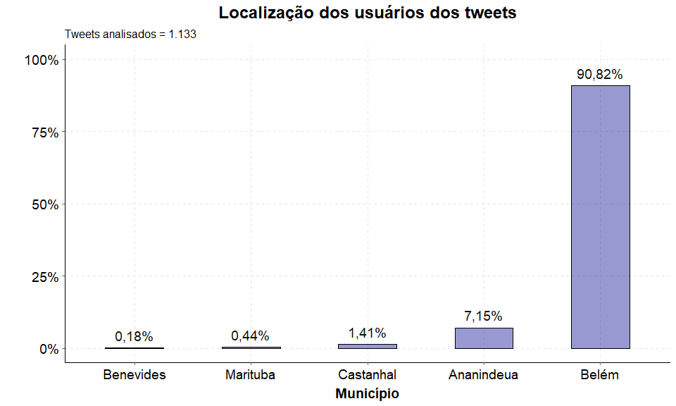
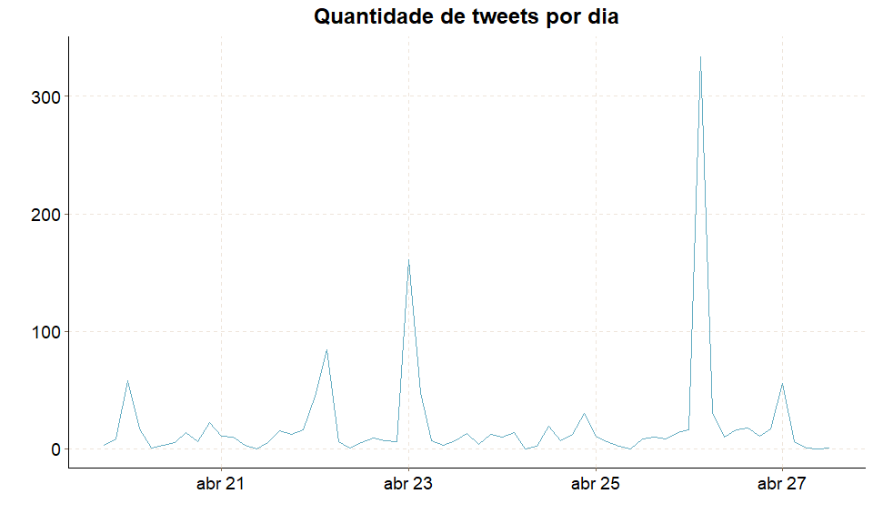

Estava eu olhando [meu twitter](https://twitter.com/RafaelbarbosaS_), enquanto caía um famoso toró que começou ainda de madrugada, quando vejo alguns tweets do [Belém Trânsito](https://twitter.com/belemtransito), um perfil que informa sobre a situação do trânsito em Belém, informando o caos nas ruas. E para ajudar a população divulgando os vídeos de alagamento, como [este](https://twitter.com/caboquisse/status/1236344836057444353?s=20), [este](https://twitter.com/belemtransito/status/1236429030829801473?s=20) ou [esta disputa de natação](https://twitter.com/belemtransito/status/1236429030829801473?s=20) em um dos canais que têm na cidade.


## Metodologia


Irei utilizar o software R (Rstudio) e pacote ```rtweet``` para buscar os tweets associados a "#BelemAlagada" e "chuva" nos últimos 10 dias. O período é por conta das condições da API do twitter que só nos permite fazer a busca neste intervalo de tempo. 


## Mão na massa

### Como baixar os dados 

Primeiramente para termos acesso a API do twitter para obter estes dados, devemos ter uma conta e criar um app no twitter (coisa dos desenvolvedores, nesse caso somos um destes).

O professor Kearney, da universidade de Missouri, ministrou um workshop em que explicou muito bem como criar um app no twitter e pegar suas keys o link está [aqui](https://mkearney.github.io/nicar_tworkshop/#1) (em inglês), assim como as funcionalidades do pacote ```rtweet``` que também podem ser acessadas [aqui](https://rtweet.info/). 


Como não as keys são pessoais e ligadas a sua conta, não posso mostrar a minha, correto ?


### Pacotes utilizados

Os pacotes utilizados para a presente análise foram:


1. rtweet
2. tidyverse
3. lubridate
4. tidytext
5. ggthemr
6. abjutils
7. DT
8. tm
9. wordcloud2
10. plotly

A forma de carregar estes pacotes (de algum jeito que vi na web mas não lembro em qual stackoverflow eu vi na vida, peço desculpas desde já) pode ser feita assim ó:


```r
if(!require(tidyverse)) {
  install.packages("tidyverse", dependencies = T);
  require(tidyverse)
}

if(!require(rtweet)) {
  install.packages("rtweet", dependencies = T);
  require(rtweet)
}


if(!require(lubridate)) {
  install.packages("lubridate", dependencies = T);
  require(lubridate)
}


if(!require(tidytext)) {
  install.packages("tidytext", dependencies = T);
  require(tidytext)
}


if(!require(ggthemr)) {
  install.packages("ggthemr", dependencies = T);
  require(ggthemr)
}


if(!require(abjutils)) {
  install.packages("abjutils", dependencies = T);
  require(abjutils)
}


if(!require(kableExtra)) {
  install.packages("kableExtra", dependencies = T);
  require(kableExtra)
}


if(!require(tm)) {
  install.packages("tm", dependencies = T);
  require(tm)
}


if(!require(wordcloud2)) {
  install.packages("wordcloud2", dependencies = T);
  require(wordcloud2)
}


if(!require(plotly)) {
  install.packages("plotly", dependencies = T);
  require(plotly)
}
```


### Configurações adicionais

A `formato_real_graf` vêm do [stackoverflow](https://pt.stackoverflow.com/questions/216852/adicionar-nota%C3%A7%C3%A3o-de-moeda-em-r) e `ggthemr` padroniza os gráficos em um tema específico chamado fresh.


```r
formato_real_graf <- function(values, nsmall = 0) { #- Formatando o valor como moeda
  values %>%
    as.numeric() %>%
    format(nsmall = nsmall, decimal.mark = ",", big.mark = ".") %>%
    str_trim()
}


ggthemr('fresh')
```


### Baixando os dados via API do twitter


Já com as keys e token criadas e setadas, podemos baixar os dados com a função ```search_tweets```.


```r
tweets <- search_tweets(q = "chuva OR #BelemAlagada", # Palavras-chave
                        include_rts = F, # Retirar os tweets que foram RT
                        n = 18000, # Número máximo de tweets
                        type = "recent", # Tweets mais recentes
                        geocode = "-1.404242,-48.435261,30km") # Em um raio de 40km do entroncamento
```


Temos um banco de dados com 1297 linhas e 90 colunas, ou seja, 1297 tweets com que continham a #BelemAlagada ou #chuva.


### Estrutura dos dados


A estrutura dos dados podem ser verificadas a seguir


```r
tweets %>% 
  glimpse
```

```
## Observations: 1,297
## Variables: 90
## $ user_id                 <chr> "774822296", "2731157277", "2731157277", "8...
## $ status_id               <chr> "1254758483813183488", "1254667502182969344...
## $ created_at              <dttm> 2020-04-27 13:05:09, 2020-04-27 07:03:37, ...
## $ screen_name             <chr> "luabarrox", "maluchad", "maluchad", "phdur...
## $ text                    <chr> "construir uma cena é algo muito foda porqu...
## $ source                  <chr> "Twitter for Android", "Twitter for Android...
## $ display_text_width      <dbl> 275, 69, 25, 248, 25, 114, 19, 43, 69, 120,...
## $ reply_to_status_id      <chr> NA, "1254632833504686080", NA, NA, NA, NA, ...
## $ reply_to_user_id        <chr> NA, "214236476", NA, NA, NA, NA, NA, NA, NA...
## $ reply_to_screen_name    <chr> NA, "rrodrigolima", NA, NA, NA, NA, NA, NA,...
## $ is_quote                <lgl> FALSE, FALSE, FALSE, FALSE, FALSE, TRUE, TR...
## $ is_retweet              <lgl> FALSE, FALSE, FALSE, FALSE, FALSE, FALSE, F...
## $ favorite_count          <int> 3, 0, 0, 0, 0, 3, 0, 0, 0, 0, 3, 3, 1, 0, 0...
## $ retweet_count           <int> 1, 0, 0, 0, 0, 0, 0, 0, 0, 0, 0, 0, 0, 0, 0...
## $ quote_count             <int> NA, NA, NA, NA, NA, NA, NA, NA, NA, NA, NA,...
## $ reply_count             <int> NA, NA, NA, NA, NA, NA, NA, NA, NA, NA, NA,...
## $ hashtags                <list> [NA, NA, NA, NA, NA, NA, NA, NA, NA, NA, N...
## $ symbols                 <list> [NA, NA, NA, NA, NA, NA, NA, NA, NA, NA, N...
## $ urls_url                <list> [NA, NA, NA, NA, NA, "twitter.com/UPotigua...
## $ urls_t.co               <list> [NA, NA, NA, NA, NA, "https://t.co/voT9yIE...
## $ urls_expanded_url       <list> [NA, NA, NA, NA, NA, "https://twitter.com/...
## $ media_url               <list> ["http://pbs.twimg.com/tweet_video_thumb/E...
## $ media_t.co              <list> ["https://t.co/t2fzsBHqym", NA, NA, NA, "h...
## $ media_expanded_url      <list> ["https://twitter.com/luabarrox/status/125...
## $ media_type              <list> ["photo", NA, NA, NA, "photo", NA, NA, NA,...
## $ ext_media_url           <list> ["http://pbs.twimg.com/tweet_video_thumb/E...
## $ ext_media_t.co          <list> ["https://t.co/t2fzsBHqym", NA, NA, NA, "h...
## $ ext_media_expanded_url  <list> ["https://twitter.com/luabarrox/status/125...
## $ ext_media_type          <chr> NA, NA, NA, NA, NA, NA, NA, NA, NA, NA, NA,...
## $ mentions_user_id        <list> [NA, "214236476", NA, NA, NA, NA, NA, NA, ...
## $ mentions_screen_name    <list> [NA, "rrodrigolima", NA, NA, NA, NA, NA, N...
## $ lang                    <chr> "pt", "pt", "pt", "pt", "pt", "pt", "pt", "...
## $ quoted_status_id        <chr> NA, NA, NA, NA, NA, "1254587417023176707", ...
## $ quoted_text             <chr> NA, NA, NA, NA, NA, "Tempestade elétrica em...
## $ quoted_created_at       <dttm> NA, NA, NA, NA, NA, 2020-04-27 01:45:23, 2...
## $ quoted_source           <chr> NA, NA, NA, NA, NA, "Twitter Web App", "Twi...
## $ quoted_favorite_count   <int> NA, NA, NA, NA, NA, 2285, 79, NA, NA, NA, N...
## $ quoted_retweet_count    <int> NA, NA, NA, NA, NA, 470, 8, NA, NA, NA, NA,...
## $ quoted_user_id          <chr> NA, NA, NA, NA, NA, "789176181123715072", "...
## $ quoted_screen_name      <chr> NA, NA, NA, NA, NA, "UPotiguara", "Galdino2...
## $ quoted_name             <chr> NA, NA, NA, NA, NA, "Ulysses Potiguara", "S...
## $ quoted_followers_count  <int> NA, NA, NA, NA, NA, 128, 848, NA, NA, NA, N...
## $ quoted_friends_count    <int> NA, NA, NA, NA, NA, 15, 314, NA, NA, NA, NA...
## $ quoted_statuses_count   <int> NA, NA, NA, NA, NA, 119, 1514, NA, NA, NA, ...
## $ quoted_location         <chr> NA, NA, NA, NA, NA, "Belém", "", NA, NA, NA...
## $ quoted_description      <chr> NA, NA, NA, NA, NA, "Full stack developer e...
## $ quoted_verified         <lgl> NA, NA, NA, NA, NA, FALSE, FALSE, NA, NA, N...
## $ retweet_status_id       <chr> NA, NA, NA, NA, NA, NA, NA, NA, NA, NA, NA,...
## $ retweet_text            <chr> NA, NA, NA, NA, NA, NA, NA, NA, NA, NA, NA,...
## $ retweet_created_at      <dttm> NA, NA, NA, NA, NA, NA, NA, NA, NA, NA, NA...
## $ retweet_source          <chr> NA, NA, NA, NA, NA, NA, NA, NA, NA, NA, NA,...
## $ retweet_favorite_count  <int> NA, NA, NA, NA, NA, NA, NA, NA, NA, NA, NA,...
## $ retweet_retweet_count   <int> NA, NA, NA, NA, NA, NA, NA, NA, NA, NA, NA,...
## $ retweet_user_id         <chr> NA, NA, NA, NA, NA, NA, NA, NA, NA, NA, NA,...
## $ retweet_screen_name     <chr> NA, NA, NA, NA, NA, NA, NA, NA, NA, NA, NA,...
## $ retweet_name            <chr> NA, NA, NA, NA, NA, NA, NA, NA, NA, NA, NA,...
## $ retweet_followers_count <int> NA, NA, NA, NA, NA, NA, NA, NA, NA, NA, NA,...
## $ retweet_friends_count   <int> NA, NA, NA, NA, NA, NA, NA, NA, NA, NA, NA,...
## $ retweet_statuses_count  <int> NA, NA, NA, NA, NA, NA, NA, NA, NA, NA, NA,...
## $ retweet_location        <chr> NA, NA, NA, NA, NA, NA, NA, NA, NA, NA, NA,...
## $ retweet_description     <chr> NA, NA, NA, NA, NA, NA, NA, NA, NA, NA, NA,...
## $ retweet_verified        <lgl> NA, NA, NA, NA, NA, NA, NA, NA, NA, NA, NA,...
## $ place_url               <chr> NA, NA, NA, NA, NA, NA, NA, NA, NA, NA, NA,...
## $ place_name              <chr> NA, NA, NA, NA, NA, NA, NA, NA, NA, NA, NA,...
## $ place_full_name         <chr> NA, NA, NA, NA, NA, NA, NA, NA, NA, NA, NA,...
## $ place_type              <chr> NA, NA, NA, NA, NA, NA, NA, NA, NA, NA, NA,...
## $ country                 <chr> NA, NA, NA, NA, NA, NA, NA, NA, NA, NA, NA,...
## $ country_code            <chr> NA, NA, NA, NA, NA, NA, NA, NA, NA, NA, NA,...
## $ geo_coords              <list> [<NA, NA>, <NA, NA>, <NA, NA>, <NA, NA>, <...
## $ coords_coords           <list> [<NA, NA>, <NA, NA>, <NA, NA>, <NA, NA>, <...
## $ bbox_coords             <list> [<NA, NA, NA, NA, NA, NA, NA, NA>, <NA, NA...
## $ status_url              <chr> "https://twitter.com/luabarrox/status/12547...
## $ name                    <chr> "blogayrinha \U0001f308", "\U0001d454\U0001...
## $ location                <chr> "Belém, Brasil", "belém br", "belém br", "B...
## $ description             <chr> "Libriana pertencente à casa de Corvinal, m...
## $ url                     <chr> "https://t.co/l02elDFx6x", NA, NA, "https:/...
## $ protected               <lgl> FALSE, FALSE, FALSE, FALSE, FALSE, FALSE, F...
## $ followers_count         <int> 2369, 460, 460, 721, 23, 735, 200, 200, 51,...
## $ friends_count           <int> 276, 449, 449, 1367, 104, 564, 174, 174, 46...
## $ listed_count            <int> 97, 1, 1, 0, 0, 0, 0, 0, 0, 0, 0, 0, 0, 0, ...
## $ statuses_count          <int> 149145, 7094, 7094, 13301, 892, 12112, 1868...
## $ favourites_count        <int> 30066, 5562, 5562, 66000, 3465, 21350, 2522...
## $ account_created_at      <dttm> 2012-08-23 00:43:32, 2014-08-01 22:57:25, ...
## $ verified                <lgl> FALSE, FALSE, FALSE, FALSE, FALSE, FALSE, F...
## $ profile_url             <chr> "https://t.co/l02elDFx6x", NA, NA, "https:/...
## $ profile_expanded_url    <chr> "http://www.lesbout.com.br", NA, NA, "http:...
## $ account_lang            <lgl> NA, NA, NA, NA, NA, NA, NA, NA, NA, NA, NA,...
## $ profile_banner_url      <chr> "https://pbs.twimg.com/profile_banners/7748...
## $ profile_background_url  <chr> "http://abs.twimg.com/images/themes/theme14...
## $ profile_image_url       <chr> "http://pbs.twimg.com/profile_images/124193...
```


### Modificação dos dados


Podemos verificar que temos uma variável que possui a localização dos tweets, vamos mostrar algumas randômicas.


<table class="table table-striped" style="width: auto !important; margin-left: auto; margin-right: auto;">
 <thead>
  <tr>
   <th style="text-align:left;"> location </th>
  </tr>
 </thead>
<tbody>
  <tr>
   <td style="text-align:left;"> Castanhal/Maraba Pa </td>
  </tr>
  <tr>
   <td style="text-align:left;"> Belém, Brasil </td>
  </tr>
  <tr>
   <td style="text-align:left;"> Belém, Pará </td>
  </tr>
  <tr>
   <td style="text-align:left;"> Belém, Brasil </td>
  </tr>
  <tr>
   <td style="text-align:left;"> Belém-PA </td>
  </tr>
  <tr>
   <td style="text-align:left;"> Belém, Brasil </td>
  </tr>
  <tr>
   <td style="text-align:left;"> Belém, Brasil </td>
  </tr>
  <tr>
   <td style="text-align:left;"> belém - pa </td>
  </tr>
  <tr>
   <td style="text-align:left;"> Guamá, Belém </td>
  </tr>
  <tr>
   <td style="text-align:left;"> Belém, Brasil </td>
  </tr>
</tbody>
</table>

Podemos perceber que temos regiões como Ananindeua, Belém e Castanhal, claro que estão a um raio de 30km do entroncamento, devido a isto aparecem. Mas podemos verificar que Belém possui variações de escrita (belém, Nárnia - Belém, etc). Logo devemos unificar elas com algumas modificações.


<table class="table table-striped" style="width: auto !important; margin-left: auto; margin-right: auto;">
 <thead>
  <tr>
   <th style="text-align:left;"> location </th>
   <th style="text-align:left;"> nova_local </th>
  </tr>
 </thead>
<tbody>
  <tr>
   <td style="text-align:left;"> belem, brasil </td>
   <td style="text-align:left;"> Belém </td>
  </tr>
  <tr>
   <td style="text-align:left;"> belem, brasil </td>
   <td style="text-align:left;"> Belém </td>
  </tr>
  <tr>
   <td style="text-align:left;"> belem, brasil </td>
   <td style="text-align:left;"> Belém </td>
  </tr>
  <tr>
   <td style="text-align:left;"> belem do para - brasil </td>
   <td style="text-align:left;"> Belém </td>
  </tr>
  <tr>
   <td style="text-align:left;"> belem - pa - brasil </td>
   <td style="text-align:left;"> Belém </td>
  </tr>
  <tr>
   <td style="text-align:left;"> ananindeua - para </td>
   <td style="text-align:left;"> Ananindeua </td>
  </tr>
  <tr>
   <td style="text-align:left;"> belem, brasil </td>
   <td style="text-align:left;"> Belém </td>
  </tr>
  <tr>
   <td style="text-align:left;"> belem, brasil </td>
   <td style="text-align:left;"> Belém </td>
  </tr>
  <tr>
   <td style="text-align:left;"> belem, brasil </td>
   <td style="text-align:left;"> Belém </td>
  </tr>
  <tr>
   <td style="text-align:left;"> belem, brasil </td>
   <td style="text-align:left;"> Belém </td>
  </tr>
</tbody>
</table>


### Localização dos tweets 


Agora que modificamos a variável `nova_local` podemos fazer quais são as localizações mais frequentes nos tweets.





Podemos perceber que a maioria (esmagadora) dos tweets relacionadas a #BelemAlagada e a chuva era realmente em Belém, mas não podemos tirar o fato que ocorreu nos outros municípios próximos de Belém. 


### Quantos tweets relacionados por dia (thinking) ?




Podemos verificar há um pico de mais de 2000 tweets relacionados a #BelemAlagada ou chuva na região de Belém, durante este período de chuvas. 


### Quais os usuários que mais mencionaram #BelemAlagada ou chuva


<table class="table table-striped" style="width: auto !important; margin-left: auto; margin-right: auto;">
 <thead>
  <tr>
   <th style="text-align:left;"> Usuário </th>
   <th style="text-align:right;"> Frequência </th>
  </tr>
 </thead>
<tbody>
  <tr>
   <td style="text-align:left;"> aindaecedoamor_ </td>
   <td style="text-align:right;"> 8 </td>
  </tr>
  <tr>
   <td style="text-align:left;"> garcia11__ </td>
   <td style="text-align:right;"> 7 </td>
  </tr>
  <tr>
   <td style="text-align:left;"> chrisvier </td>
   <td style="text-align:right;"> 6 </td>
  </tr>
  <tr>
   <td style="text-align:left;"> leticiaag__ </td>
   <td style="text-align:right;"> 5 </td>
  </tr>
  <tr>
   <td style="text-align:left;"> twerklopez </td>
   <td style="text-align:right;"> 5 </td>
  </tr>
  <tr>
   <td style="text-align:left;"> ___aquariano </td>
   <td style="text-align:right;"> 4 </td>
  </tr>
  <tr>
   <td style="text-align:left;"> _CGabs </td>
   <td style="text-align:right;"> 4 </td>
  </tr>
  <tr>
   <td style="text-align:left;"> airamvit_ </td>
   <td style="text-align:right;"> 4 </td>
  </tr>
  <tr>
   <td style="text-align:left;"> bryandernie </td>
   <td style="text-align:right;"> 4 </td>
  </tr>
  <tr>
   <td style="text-align:left;"> giovannavillar </td>
   <td style="text-align:right;"> 4 </td>
  </tr>
</tbody>
</table>
Temos que mencionar o grande trabalho do [Belém Trânsito](https://twitter.com/belemtransito) que compartilha grandes informações com todo o twitter sobre a situação de Belém, não somente neste período de chuvas, mas em literalmente qualquer problema, vai de chuva a greve de ônibus. Inclusive, se você comentou algo sobre chuva o #BelemAlagada, veja se seu @ não está aí com a quantidade ;)


### Quais as palavras mais utilizadas com a #BelemAlagada ou chuva ?


Inicialmente temos que passar por um processo de limpeza dos tweets e remover pontuações, espaços em brancos, etc, para que fique somente as palavras corretas para que podemos associar a um dicionário. A função utilizada foi a `cleanTweets` do [Fellipe Gomes](https://gomesfellipe.github.io/) que pode ser encontrada [aqui](https://github.com/gomesfellipe/functions/blob/master/cleanTweets.R)  com algumas modificações.

Posteriormente utilizar a função `unnest_tokens` do pacote _tidytext_ para que ele separe cada palavra por linha, fazendo com o que banco aumente, apesar de tudo. 


<table class="table table-striped" style="width: auto !important; margin-left: auto; margin-right: auto;">
 <thead>
  <tr>
   <th style="text-align:left;"> word </th>
  </tr>
 </thead>
<tbody>
  <tr>
   <td style="text-align:left;"> construir </td>
  </tr>
  <tr>
   <td style="text-align:left;"> uma </td>
  </tr>
  <tr>
   <td style="text-align:left;"> cena </td>
  </tr>
  <tr>
   <td style="text-align:left;"> é </td>
  </tr>
  <tr>
   <td style="text-align:left;"> algo </td>
  </tr>
  <tr>
   <td style="text-align:left;"> muito </td>
  </tr>
  <tr>
   <td style="text-align:left;"> foda </td>
  </tr>
  <tr>
   <td style="text-align:left;"> porque </td>
  </tr>
  <tr>
   <td style="text-align:left;"> você </td>
  </tr>
  <tr>
   <td style="text-align:left;"> introduzir </td>
  </tr>
</tbody>
</table>

Agora iremos buscar o dicionário (ou stop words) do pacote `tm`, fazer um [anti_join](https://dplyr.tidyverse.org/reference/join.html), retorna todas as linhas de x onde não há valores correspondentes em y, mantendo apenas as colunas de x e filtras pelas palavras que não é "Belém", já que sabemos que ela faz parte da pesquisa inicial.


<table class="table table-striped" style="width: auto !important; margin-left: auto; margin-right: auto;">
 <thead>
  <tr>
   <th style="text-align:left;"> word </th>
   <th style="text-align:right;"> n </th>
  </tr>
 </thead>
<tbody>
  <tr>
   <td style="text-align:left;"> é </td>
   <td style="text-align:right;"> 178 </td>
  </tr>
  <tr>
   <td style="text-align:left;"> tá </td>
   <td style="text-align:right;"> 145 </td>
  </tr>
  <tr>
   <td style="text-align:left;"> aqui </td>
   <td style="text-align:right;"> 113 </td>
  </tr>
  <tr>
   <td style="text-align:left;"> vai </td>
   <td style="text-align:right;"> 88 </td>
  </tr>
  <tr>
   <td style="text-align:left;"> dormir </td>
   <td style="text-align:right;"> 83 </td>
  </tr>
  <tr>
   <td style="text-align:left;"> gente </td>
   <td style="text-align:right;"> 67 </td>
  </tr>
  <tr>
   <td style="text-align:left;"> q </td>
   <td style="text-align:right;"> 65 </td>
  </tr>
  <tr>
   <td style="text-align:left;"> agora </td>
   <td style="text-align:right;"> 62 </td>
  </tr>
  <tr>
   <td style="text-align:left;"> tudo </td>
   <td style="text-align:right;"> 55 </td>
  </tr>
  <tr>
   <td style="text-align:left;"> nada </td>
   <td style="text-align:right;"> 54 </td>
  </tr>
</tbody>
</table>

E agora podemos ver em uma nuvem de palavras, que talvez seja a visualização de dados mais adequada, com o pacote `wordcloud2`.


```r
wordcloud2(data = banco_freq, size = .7,
           shape = "oval",
           rotateRatio = 0.5,
           ellipticity = 0.9, color = "random-dark")
```

<!--html_preserve--><div id="htmlwidget-d3b7c2e3fede5c798441" style="width:672px;height:480px;" class="wordcloud2 html-widget"></div>
<script type="application/json" data-for="htmlwidget-d3b7c2e3fede5c798441">{"x":{"word":["é","tá","aqui","vai","dormir","gente","q","agora","tudo","nada","belém","pq","to","casa","noite","arroz","barulho","madrugada","medo","tô","ser","muita","ta","cair","céu","dia","queria","lá","ainda","caindo","vou","banho","tava","meteoros","toda","ter","amo","deus","forte","p","vem","ver","chove","imaginando","n","sol","aí","sabe","boa","cai","dessa","mundo","bem","ficar","tarde","todo","trovão","amor","frente","hoje","hora","mim","água","fazer","janela","quero","ai","bom","calor","faz","mano","olha","cara","caralho","égua","fim","ir","tempo","acho","cidade","guarda","h","nessa","passar","sair","trovões","acordei","assim","igreja","meio","país","porra","uns","causa","chegou","começou","falando","frio","vamos","caiu","chorando","chovendo","fiquei","melhor","nunca","ontem","pai","pegar","porque","quarto","vez","agr","babu","coisa","live","pro","tomar","veio","vento","antes","bolinho","ia","mds","nao","quarentena","raios","rua","amanhã","cama","crl","dando","lágrimas","manhã","pouco","raio","saudade","som","tão","torando","alguém","cantando","chover","fica","momento","música","nesse","novo","pode","pois","puta","sobre","tanto","todos","barulhinho","c","comigo","conchinha","dá","dentro","enquanto","então","fazendo","fico","foda","gt","hj","logo","molha","mt","pensando","quente","sei","sempre","sinal","tanta","triste","vontade","acabou","amiga","cá","coisas","daqui","deixa","deixar","demais","estar","lembro","mãe","ouvindo","pedro","peguei","relâmpago","show","vi","votos","acordar","bicho","clima","desse","durmo","esperando","falar","gatilho","grande","hein","horas","ja","la","né","normal","ok","olhando","outra","parasita","pessoa","porta","povo","real","sendo","so","sono","trabalho","vendo","aberta","amigo","atrás","augusto","café","corona","d","desde","domingo","eh","escutando","faça","falta","fez","gosto","lembra","menos","mulher","onde","pará","passa","perdi","perfeito","pessoas","pior","posso","poxa","rede","sim","telefone","tomando","tomara","vida","viu","ananindeua","ar","assistir","baixo","brasil","cachorra","cedo","cena","certeza","dar","deitado","deitar","dessas","deu","deve","dormindo","durante","ei","eita","endereço","espero","gostosa","igual","lembrando","linda","luz","maior","mamãe","molhada","ninguém","ny","olhar","ônibus","paraense","pegando","pingo","quer","relâmpagos","roupa","saber","simplesmente","tb","telhado","tendo","tirar","tome","toró","vírus","amigos","ano","apartamento","aproveitar","aula","bar","boy","cachorro","cada","cadê","canta","chão","chega","cheio","cheiro","chorar","começa","consigo","cu","debaixo","deixou","dias","disse","enfim","entrar","falou","ficam","ficou","fogo","formando","galera","gota","gravar","internet","jaloo","kkkk","lindo","manu","molhar","natureza","nova","obrigada","obrigado","ouvi","ouvir","parece","passou","pé","pedi","pfvr","piorar","poder","pôr","preciso","primeira","quase","quintal","rolando","s","sacanagem","sala","socorro","sombrinha","tbm","tempestade","tentar","tento","tira","umas","única","vc","achando","achei","acordada","agarrada","anos","aq","assistindo","babado","barulhos","bebendo","bloco","branco","cabeça","caia","carinha","carnaval","carro","casinha","caso","centro","certa","chegar","cheguei","cheia","chocolate","choveu","cima","clarões","comida","comprar","continuar","coração","criança","desculpa","desejo","diferente","dilúvio","direção","dizer","dois","dormi","embora","esquecer","esqueci","estrada","favor","feira","feliz","filha","filho","fiz","foto","gato","gostoso","gripe","guamá","homem","horário","indo","inferno","joelma","jogar","jogo","kkk","lado","levantar","levar","maravilhosa","menina","minutos","misericórdia","molhado","mora","moral","morro","moura","mutirão","nenhum","nenhuma","noites","nome","norte","nuvem","olhos","outeiro","outro","papai","pare","parte","paz","pensar","pensei","pesada","peso","porém","pqp","precisava","preguiça","primeiro","problema","problemas","pronto","reais","rinite","ruim","sábado","saída","sdds","segue","sensação","sentindo","sério","sexta","sorvete","super","talvez","temporal","tentando","thelma","tipo","tomei","traz","vê","vejo","verde","vim","vindo","viver","vivo","vizinho","voltei","abençoe","aberto","abrir","absolutamente","acabar","acabei","acontece","acordado","aff","agarradinho","aguentar","aguento","alagada","alagam","além","algo","amando","amasse","amém","apesar","aproveitando","assustando","baita","batendo","bbb","belo","bolo","buscar","caixa","campeã","cantar","caos","carência","casas","case","cavalo","celular","ceu","clarão","começar","comendo","comer","conseguindo","correr","costela","covid","criar","culpa","cus","dei","deixando","desta","difícil","disso","dizendo","drink","duas","dvd","egua","eis","eliminação","encher","entendo","época","escola","esperar","estranho","etc","evento","faltava","família","fechar","fila","filme","fundo","gay","gostosinho","horrível","hrs","icoaraci","interior","irmão","janelas","jesus","jogando","kk","kkkkkk","lágrima","legal","lembrar","leve","líridas","livro","lo","louco","lugar","madruga","maldito","mana","mar","mari","meia","merda","mês","meteoro","mó","monteblack","montenegro","morre","morrendo","moto","msm","mta","mufina","muitas","muitos","neste","nublado","obg","odeio","ódio","oh","ótima","parou","pátio","pega","pena","penso","pfv","plena","portão","precisa","precisando","preso","qualquer","quanto","quarta","querem","região","sabendo","sabia","saco","sai","saiu","scrr","sdd","secar","senhor","sinceramente","sinto","sonho","sorte","sozinho","the","tia","tocando","todas","top","torrencial","traiu","trás","trovejando","vão","varanda","vários","vcs","vezes","visto","vitória","volta","abelha","abraçado","acaba","acabando","acha","acontecendo","acontecer","acorda","adeus","admirar","af","aflito","agoniado","ah","ajudar","alaga","alagamento","alagando","alegria","algodoal","algum","algumas","alguns","ali","alien","alta","alto","ama","amanhece","amanheceu","amp","andando","ando","anoiteceu","apenas","apocalipse","aposta","aproveita","arco","arrumando","assisto","assunto","assustada","atenção","avenida","banheiro","barracas","basta","bastante","bateu","batom","beber","beijo","bençãos","benzinho","bizarra","boas","boatos","bolinhos","bolsonaro","bons","bora","boto","brazil","brilho","cagando","calma","camisa","cantei","canto","cão","capa","caras","carente","carta","casos","castanhal","cavalinho","chama","chamando","chances","chave","chuvas","chuvinha","cicatriz","cigarro","cinco","clara","cmg","cn","coloca","colocar","coma","começando","começo","comemorar","comum","concha","condicionado","confesso","consegue","consegui","conseguiu","conta","contexto","continue","contrário","cor","corpo","correndo","costa","costas","crédito","crush","cuidar","curtindo","daí","daquela","daquelas","deitada","deixam","deixe","deixei","deixo","delícia","demorou","deram","desabando","descaso","desgraçada","desgraçado","desses","devagar","devia","direto","doca","doce","dona","dor","dores","dorme","dormiu","efeito","eliminado","elogiar","emily","enche","energia","entende","entender","entendeu","errado","escura","escutar","espaço","especial","espera","esperou","esquentando","esquina","estado","estaria","estendendo","esto","estragar","explicar","fácil","faço","fala","falei","famílias","fato","fazenda","fazia","fé","fecha","fechados","ferro","ficava","filhotes","final","floresta","fode","fofo","fone","foraaaaaa","força","fortaleza","frango","friozinho","fritando","fuder","fumar","gados","ganhar","geral","gizelly","gnt","gostinho","goteira","goteiras","governador","graça","graças","grandes","hino","hm","hr","iarlla","idade","ilha","inclusive","incrível","inteiro","inter","inverno","íris","irmã","irmãs","j","janeiro","jeito","kid","kkkkkkkkk","kkkkkkkkkkkkkk","lanche","lavar","lenta","levantei","lixo","locais","lua","luan","maia","maju","mal","manda","mandado","mandar","manter","maravilhoso","maré","matar","mateus","médicos","memórias","metade","mimir","minuto","mixuruca","mo","molhados","molhe","morreu","morri","mudar","mufino","murubira","muuuita","ñ","namoro","ne","necessidade","negócio","nele","nerazzuri","nesses","ngm","nível","noção","novos","nuvens","ô","odio","olfato","olho","oq","oque","organizar","ossos","ouro","outros","ouvidos","ovos","pa","pais","paladar","pancadas","panela","parabéns","parar","pariu","passando","pau","pedra","pegou","peito","pensa","pensamentos","pequena","pequeno","pequenos","perderam","perfeita","perfil","pergunta","perto","pessoal","pingos","pizza","playlist","pleno","pneumonia","podem","poderá","podia","pouca","poucos","pouquinho","praia","preço","presidente","preto","previsão","proibido","prometendo","pronunciamento","própria","próprio","pros","próxima","próximo","ps","pude","puder","qnd","quanta","querer","questão","quis","quiser","raça","rafa","raiva","reinar","remo","resolveu","responsáveis","resultado","risco","rodrigo","rolar","role","romântica","ruins","sabão","saio","salvar","sapê","saudades","saúde","segredos","seguir","segundo","segundos","sentia","sentido","sentir","série","setor","sido","sky","sofá","solidão","solto","solzinho","sonhando","soninho","sozinha","suave","surto","susto","t","tal","tao","telha","tênis","tentei","terça","testes","tirem","título","tl","toca","todinha","tomou","tranquilo","travesseiro","três","treze","trovoada","trovoes","tv","tweet","twitter","único","usar","vamo","vdd","ve","ventinho","vermelho","vier","vila","vinda","violão","virado","virar","virose","vitoria","vivendo","vo","voce","voltando","voltar","voltou","vovó","wagner","x","youtube","aa","aaa","aaaaaa","aaaaaaaaaa","aaaaahh","abadás","abafado","abalou","abertas","abertos","abortinhos","abraçada","abraçadinho","abraçar","abre","abri","abrigar","abrigo","abril","abrill","abrindo","absorver","absurdo","acabado","acabasse","acalma","acasos","acbei","aceitar","acelerado","acendi","acendo","acessivel","achar","achooooo","acima","acinzentada","acionados","aconteça","aconteceu","acordo","acostumado","acreditar","acreditem","acredito","adams","adele","adriana","adriano","advinhar","afastar","affff","afim","afinado","afogar","afrodite","agarra","agarradinha","agarradinhos","agarrado","agindo","aglomeração","aglomerações","aglomerada","agoniada","agoniando","agorinha","agradecendo","agradecer","agradecimentos","agradeço","agrário","aguentando","ahh","ahhahau","ahhhhhh","aiii","aja","ajude","akakaahahaha","aladim","alagadas","alagadissimo","alagado","alagamentos","alagar","alagáveis","alagou","alague","alaska","alastrando","alcione","aldir","aleatório","alegrar","alemão","alergia","alexandre","alguem","alguma","aliens","alimentação","alladim","almirante","almoço","altamirense","altura","alunos","alvorecer","amadah","amado","amadoh","amanhecer","amanheceram","amantes","amapá","amargo","amarrado","amassada","amazonas","ambiente","ameaça","amei","amendoim","amigas","amiguinha","amiguinhos","amoooo","amord","amore","amores","amou","ana","andar","andrya","angústia","animada","animal","anime","aninhos","aniversariante","anjo","ansiedade","ansioso","antaaa","anualmente","anunciada","anunciando","apagar","apaixonei","apanha","apareça","aparecer","apareceu","aparelho","aparentemente","apartamentoooooo","apavorada","ápice","apocalíptica","apologia","após","aprecia","apresentou","apx","aquecer","aquietar","aquisição","aranha","área","áreas","armando","armas","arranjei","arrebatamento","arrependidos","arrependo","arriou","arriscando","arrombado","arrooooooz","arrozzzzzz","arrozzzzzzzzzzz","árvores","asas","assisti","assobio","assusta","astronômico","atacado","atacarrrrrrr","ate","atenta","atingidas","atrai","atrapalharam","atrasa","atravessar","atuação","atualizando","audiência","audio","aue","auge","aumenta","aumentado","automaticamente","autores","ave","aventura","aventureira","avermelhado","aviso","axé","baaaar","babufãs","bad","bagulho","bailão","bailarina","baixinho","balançar","balas","balde","baldes","banda","bandido","banhar","banhos","banhozinho","baralho","bárbara","barrichello","barroso","barulhin","basílica","batata","bater","batista","batman","bb","bebe","beckinho","beijá","beijando","beijar","bela","belem","belemense","belenense","belrain","bençao","benção","bênçãos","bentinho","berço","berimbau","besta","bia","bíblia","bichadas","bichinha","bichinhos","bisa","bixo","bizarro","bjos","bjs","bk","blackout","blanc","boca","bola","bolas","bolsominios","bonequinha","bong","bongada","bonitinho","bonito","bosta","botafogo","botar","botas","botei","bozo","br","braba","braços","branca","brasileiro","breguíssima","breve","bricks","briga","brigando","brilhar","brilhinho","brincadeira","brincamos","brincando","brincava","brinquei","brisa","brokeback","bronze","brota","bruna","bruno","bryan","bu","bucetaaaaaaaa","bucha","bukake","bullying","bunda","buraco","burro","caaaair","cabanagem","cabanos","cabe","cabeleireira","cabelo","cabo","cacete","cade","cadente","cafezinho","cafuné","cagou","caía","caido","caíra","cairrrr","caísse","calabresa","calafrio","calça","calçada","calconhoto","caldeirao","calooooor","calorrr","calorzão","calúnias","calypso","caminho","camisinha","campeão","campos","canal","canção","cancelado","cancelo","cantaa","cantamos","cantany","canudos","capaz","capital","capitu","capotei","caraaa","característica","caralh","caralhoo","caramba","carambaaaaa","carapanã","carapanãs","carimbó","carinho","carne","carregadas","carregando","carteira","cartões","casamento","casamentos","casar","casseb","castigo","catarro","causado","causando","cavalcante","cavalos","cavando","caxiado","cebola","cedinho","celebrar","celpa","cercando","certo","cerveja","ces","céus","cha","chá","chameguinho","chamo","chamou","chance","chapa","chapinha","chegando","cheirinhos","cheiros","cheirosa","cheirosinha","cheque","chope","chorava","choro","chovido","churrasco","chuvade","chuvaral","ciclo","cidadão","cilio","cinderela","circuito","citando","cito","civil","claramente","clareando","claro","cliente","climinha","clipe","cm","coadjuvante","coberto","cobriram","cochilar","cochilei","coincidentemente","coincidia","colaborar","colabore","colaborou","coleira","coletivo","colinas","colocam","colocaria","coloco","colocou","colorido","combinação","combinar","combu","combú","começarei","comecei","comédia","comemoração","completando","compras","comprei","comprou","computador","conceito","concentrada","conchinhaaaaaa","condensado","condominio","conexão","confirmações","confirmar","conforta","conforte","conheçam","conhecer","conhecida","conheço","conjunção","conseguem","conseguir","conserto","consideravelmente","constantemente","constrói","construir","contar","contaram","contato","conte","contei","continuo","conto","contra","contratos","contudo","convencional","conveniência","conversar","convid","cookie","coooom","copa","copão","copo","coracao","corar","coronga","corre","corrupção","cospe","cosplay","costelinha","coube","couple","covaaas","covardes","cozinha","craniano","crise","crlh","crll","cuido","culinárias","cuns","curar","curto","cuuuuuu","cy","daaaaaalhe","dai","dama","dança","dançam","dançando","danos","dão","dark","data","dê","debate","decidir","decidiram","decretado","dedicar","dedo","defenda","defesa","definitivamente","deitei","deixado","delicada","deliciosa","delírio","dem","demaaaaaaaais","dengo","dengue","deprê","derrame","derrubar","desabaaaaar","desabafar","desabou","descabelada","descarrego","descasos","descer","descobrindo","descobrir","descobriram","descrever","desenho","desfavorável","desfazer","desgruda","desnecessário","despedida","despertar","desproporcional","destaque","deste","destino","destruídas","destruiu","desumanas","desvracada","detalhe","detalhes","detran","deuses","deuso","deusss","deux","deveria","deveriam","devo","diaba","diante","diariamente","dica","dicionário","diego","diferentes","dificil","dificilmente","dilma","diogo","diploma","direçao","direito","disbundei","discutir","disk","disseram","distante","ditadores","ditadura","dividia","dividir","divulgada","diz","dms","dodói","doenças","doeram","dog","dói","doida","dono","dora","dormiram","dou","dramático","drinks","ducha","dummie","dunada","duração","durar","durma","dvds","eclodem","ect","edredom","edredrom","educação","eeee","êeeee","eestou","egg","egoísmo","eleito","eletricidade","eletrodomésticos","eletrônico","eleva","eliminaram","elogiando","embaixador","embaixo","embuste","emocional","emocionando","empenhada","encantada","encerrar","encha","encharcar","enchente","enchia","encolhida","encontra","encontrei","encontro","encostar","enfiar","enganei","enrolada","enroladas","entao","entendem","entes","entrava","entregador","entregar","entro","entroncamento","entrou","enviou","envolvidos","enxofre","enxuta","equipamento","erkenci","erosão","erro","és","esbaforida","esbofeteia","escada","escambau","escândalo","escangalha","escoar","esconde","esconder","escondido","escrito","escrota","escurecendo","escuro","escuta","escutei","escuto","esfarelou","esfregava","esfriar","espalhando","espanha","esperança","esperanças","esperava","esperei","espetáculo","espírito","esplêndido","espremida","esquecerrrrr","esqueceu","esquecido","esquentar","esquisita","esssa","estabelecimentos","estabilidade","estação","estacionamento","estampa","estantes","estará","estarmos","estilos","estimação","estômago","estragando","estragos","estranhos","estrela","estressada","estrondos","estrutura","estudar","et","eternizar","eva","eventos","evitando","exatamente","exato","excessão","exceto","excitada","existe","explicado","explosão","exposed","expulso","externalizar","extremamente","fã","façam","facebook","faculdade","faixa","fake","falam","falamansa","falaram","fale","faltado","faltando","faltar","familiares","fandom","fantasiar","farelo","farinha","farmácias","farol","fãs","fase","favoritaaaaa","fazei","fazendinha","fazes","fãzona","fb","fdd","fechado","fechando","fechava","feche","fechei","fechou","fedida","fedorentão","feia","feita","feito","felicidade","felipe","felizmente","fêmeas","fenda","fenomenal","fera","festa","festejar","feudo","fevereiro","fezona","fi","ficado","ficaram","ficarei","fifa","filé","filhinhos","filhos","filmes","filmininho","fina","finalizando","finalmente","fingindo","fingir","fique","fiquem","fiscalização","fizeste","flauta","flopou","flores","foco","fod","fodac","fodaseh","fodendo","fodeu","fofa","folha","foode","forças","forma","fortes","fortíssima","fossa","fotografia","fotoooooo","frase","frenética","frisson","frita","fritar","fruta","fruto","fugir","fumaça","fumando","funcionar","funcionária","funcionou","fundos","funeral","gado","gaga","galhoso","galo","garagem","garota","garrafão","gás","gastei","gastronômico","gata","gatilhos","gatinha","gatinho","gatinhos","geladeira","gelado","gentee","genteeeeee","genteeeeeee","genteeeeeeee","gigante","globinho","glr","gon","gongando","gostando","gostava","goste","gostei","gostosaaaa","gostosos","gotículas","governadores","governantes","governo","governos","gracinha","grau","gravado","gravava","grilo","gripado","gritando","gritar","gritaria","grito","grosso","grupo","guamaense","hahaha","hahahahahhaha","halteres","hambúrguer","hamptons","havia","hdjjdsjkskakhdjas","heaven","hector","hehe","heitor","helicóptero","hemisfério","hetero","hhahahaha","hippie","história","hmmmm","ho","horrores","horrorizado","hospitais","hsjahsjs","hum","humilhação","humor","ía","ibl","ico","icônico","idolatra","ignorância","igualzinha","iiiihhhhj","ilhado","ilumine","ilusão","imagina","imagine","imbatível","impedindo","importante","impossível","impotência","impressão","inacreditável","incluiu","incomoda","incompleto","inconveniente","independência","índice","indio","inexplicavel","infância","infecções","infectado","infernoo","infernoooooo","inflando","info","informal","ingresso","iniciado","início","inimigos","injusto","insight","instalação","instantinho","insuportável","inteiras","inteirinha","interesse","internautas","internestico","intervalo","introduzir","inundar","invade","invisível","invocação","irá","irei","iremos","iria","isolado","isopor","itália","ivete","jaloozinho","jamais","jambú","japa","jardim","jato","jfjksksskksj","jnta","joelho","jogado","jong","joon","jorge","jorj","josé","jovens","joy","jub","julho","junho","junto","juntos","jurando","juro","jurunas","justo","jxjjxkxk","k","ketchup","killvyson","kim","king","kkkkk","kkkkkkkk","kkkkkkkkkkk","kkkkkkkkkkkkk","kkkkkkkkkkkkkkkkkkk","klb","klkkk","know","kus","lados","ladrão","lago","laje","lajsksjsks","lama","land","lanterna","laranja","larga","larica","latindo","lava","lavada","layde","league","lee","legends","leite","lembrei","lembrou","lençol","lêndeas","lendo","ler","lerumliro","lesa","leva","levam","levando","levantando","levava","levei","leves","leveza","levou","li","liberdade","libertando","licença","lidando","líder","liderança","liga","ligadão","ligam","ligar","limpa","limpasse","limpo","linha","liridos","liso","livrarias","livrei","livros","lkkkkkkkkkkkk","local","lockdown","loiro","loja","longe","longo","lotação","lotado","loucura","lovezinho","lt","lucas","lud","luminoso","lunático","lurdinha","luxo","luzes","m","macho","machuuca","maconha","maconheiro","madi","mae","mafalda","magricelo","maiores","maioria","maissss","malas","maldade","maldita","maluca","maluco","mamae","mams","manas","mandando","mandem","mando","maneirar","mangueirão","mangueiras","mangueirosa","manha","maninho","manoooo","mantém","mão","marabá","maracujá","marambaia","maravilhosas","marcado","marcar","marcas","marcava","marco","março","marcou","maria","marilia","mario","marituba","marjoca","maroto","marque","marrone","máscaras","mascote","masculino","massa","mato","maturidade","mau","máximo","mayara","medica","médica","médico","medrosa","meeedo","meeeeee","meias","meiga","mel","melhorar","melodia","melody","meme","memorável","memória","meninaa","menino","menor","mensagens","mental","mentindo","mercadoria","mereço","mermão","mesa","mesma","meta","metades","metalizado","meter","metropolitana","miado","miando","mídia","mil","milho","milhões","mimo","min","mínimo","mista","mistura","misturada","mlk","mn","mocinho","moda","moleque","moletom","molham","molho","molhou","momentos","monstro","monstros","montenegroooooo","mood","moram","morango","morar","moras","morena","mores","moro","morria","morte","mortes","mosqueiro","mostrando","motinha","motivo","mountain","móveis","mp","msg","mtas","mto","mts","muda","mudança","mudando","mugido","muitaaaaa","muitaaaaaaaaaaaaaaaaaaaaaaa","multishow","mundinho","mundos","munheca","murilo","muro","murumbira","musica","músicas","my","naaaaaaao","naaada","nadinha","namorado","namoral","namorar","nanquim","nãooooooooo","naquela","naquelas","naruto","nasce","nasceu","nasci","nazica","nd","nda","ndo","necessitado","neem","nega","negão","negra","neh","neles","nenes","neon","nervosa","nervosaaaaaa","nessas","nesta","netflix","netinhos","neto","netos","neurada","news","ninhos","niver","nogueira","nois","normais","notebook","notícias","notinhas","novinha","novinho","obedece","obriga","obrigações","obrigar","obstante","ocorrem","ocorreu","odeia","ódios","of","ofensa","oferecer","off","oi","oitavo","olhe","olhei","omano","omg","on","onda","online","only","oo","oodal","oooooohhhh","ooooooowww","oportunidade","or","orando","oriunda","orla","oscar","oscilando","osga","otária","ótimo","oto","ouça","ouço","outras","ouvia","ouvido","ouviu","óvulos","pabllo","paga","pagava","pagode","pah","paid","países","paixão","palavra","palco","palha","palhaçada","pancadão","pandemia","panelaço","pano","pão","papel","papo","pára","paraenses","parafuso","parando","parasite","parceladas","parecer","pareceu","parem","paris","parque","partir","pasmem","passado","passados","pássaros","passava","passe","passeando","passear","patinhas","pato","paulista","paulistas","pavor","pc","peço","pedalar","pede","pedido","pedindo","pedir","pego","pegue","peia","pele","pensamento","pensou","pequenas","pequeníssima","percebi","perda","perdendo","perder","perdida","perdidamente","perdoem","perfeição","perfeitamente","performance","periferia","pernas","perseguido","perversa","pesado","pescoço","pesquisa","pet","pezinho","piano","picado","pilotando","ping","pinga","piolhos","pipipipopopo","pique","pira","pirata","piroca","pirotécnico","pisou","pitaya","pixote","planeta","plano","planos","plantão","plantonista","plásticos","please","plot","pneu","pobre","poça","podcast","poderes","poderia","podres","põe","põem","pomar","ponta","pontos","porea","porrada","porres","pós","posição","positivo","possa","possibilidade","possíveis","possível","post","pouquíssimos","pragas","praiano","prata","prato","prazeres","precarização","precis","predador","prefere","preferências","pregue","prejudica","preocupação","prepara","preparada","preparando","presa","presenteou","presos","pressão","pressentimento","previsao","princesa","principalmente","principe","print","privada","privilégio","procurando","procurei","produtiva","prof","professores","profissionais","profundidade","projetos","prolonga","prometem","pronta","prontonet","proporção","proporcionar","proteção","protege","protegendo","proteger","proteja","provar","provavelmente","proverbio","provocou","provou","prs","pública","pulando","pular","pulei","pulmão","pulo","pump","purpurina","putaço","putinha","puts","putz","qndo","qodio","quais","qualidade","quantas","quarentenar","quê","quebra","quebrando","quebre","quebrem","quebrou","queijos","queimado","queimando","queimar","queiras","quentes","querendo","querentena","queridos","quinta","rachada","rações","rádio","raiar","rain","rajadão","rapa","rapidinho","raposa","rapunzel","rasgado","rasgar","rato","realidade","reclamando","reclamar","recomeçar","reconstrói","recuperando","reencontra","reflexiva","refrescos","refri","reinando","reine","relampago","relampagos","relámpagos","relampejando","relaxante","relaxar","relógio","remédio","remédios","renovado","repangalejando","repente","repetir","replys","reprise","repudiando","reservada","resolve","respeita","respirando","respiratórias","resto","retornando","reumáticas","reumatismo","ria","ridículo","rindo","riqueza","ritmo","rodolfo","rolado","rolasse","rolê","rosto","roubaram","rsssssssss","ruas","sã","saaaaaaave","saberei","saca","sacada","sacramenta","safira","saga","saí","saía","saído","saioooo","sairem","sak","salas","saliências","salvador","salve","salvou","sambari","san","santa","santana","sao","sapatao","sapequinha","satisfação","saudadeeeeeee","saudadesssss","saude","saxofone","sbt","scooby","sdv","seco","secreto","secretos","seg","segredo","seguidores","seguindo","segunda","segurei","segurou","semana","semanas","semi","senão","senhora","senhroa","sensível","senta","sentar","sente","senti","sentimento","sentimentos","sequência","sequer","sera","serassi","sereia","seres","seresteiro","shit","significado","simbolizar","símbolo","simm","sinais","sinistra","sinistro","sinta","siro","sistema","situação","sjkekwhehajs","sm","snapchat","snickers","sobrancelha","sobremesa","socar","soco","sofia","sofrendo","sofrer","sofri","sofro","solitário","solta","solteiros","solzão","somewhere","sonhei","sons","sorriiiiiiiiiiiiiiiir","spotify","sqn","sr","strokeszinhos","suando","subiria","sucesso","suco","sue","sujar","sumiu","suor","supera","superfaturados","supermercado","supostamente","surpresa","surpreso","surtei","sutilmente","tacacá","taco","taigra","talll","tals","tamaluco","tamanha","tamanho","tame","tantos","tapana","tardezinha","tatuar","tcha","tchyros","tds","techno","tédio","tédoidé","teimoso","telégrafo","telhados","tempão","tempinho","temporaaaalll","temporário","tempos","tens","tenta","tera","teram","termina","terra","terríveis","testando","teto","tetos","thor","ti","tiago","tim","timbalada","tio","tios","tirando","tire","tiro","titi","tito","tivenos","tmb","tmj","tnccc","tó","tobias","tocou","tom","toma","tomada","tomare","tomava","torcedor","torcem","torcendo","torcer","torre","tosse","totaaaaalll","total","totalmente","totó","totoro","tou","touro","trab","trabalhos","trad","tradições","traduzido","traduzindo","traga","trágica","trago","trampo","tranquilamente","transborde","transfobia","transformadores","transformasse","traumatismo","travis","trazem","trégua","tremendo","tremer","tremi","trilho","trindade","tristeza","tromba","trombetas","trouxe","trouxesse","trovada","trovoadas","tts","tudoh","turno","ub","ué","ufpa","última","umabreja","úmido","un","una","unfollow","união","unico","universidade","universo","up","urgente","usá","usando","usava","use","usou","uva","vá","vagabundo","vagabundos","vais","vale","valeu","valorizado","vanguart","vantagem","varios","vasilhas","vazando","veeeeeem","velho","vencedor","vencer","ventania","verão","verdade","verdadeira","verdes","vermelhão","versão","vestiário","vestido","via","viadinha","viado","viagem","vibe","vibrando","vice","vídeo","vidro","vindas","vip","virais","virou","virtual","vista","vit","viúva","vivas","viveu","vizinhos","vjxjsjdkkskak","voltado","voltamos","voltem","volto","voou","voto","votooooooos","vs","vsfd","vzs","warriors","we","westworld","wifi","xiaomi","xodozinho","xuruca","zenaldo","zero","zoado","zunido","zzz"],"freq":[178,145,113,88,83,67,65,62,55,54,53,49,48,46,45,44,42,42,42,41,39,38,38,37,37,37,37,36,35,35,35,34,34,33,32,31,29,29,29,29,29,29,27,27,27,27,26,26,25,25,25,25,24,24,24,24,24,23,23,23,23,23,22,22,22,21,20,20,20,20,20,20,19,19,19,19,19,19,18,18,18,18,18,18,18,18,17,17,17,17,17,17,17,16,16,16,16,16,16,15,15,15,15,15,15,15,15,15,15,15,15,14,14,14,14,14,14,14,14,13,13,13,13,13,13,13,13,12,12,12,12,12,12,12,12,12,12,12,12,11,11,11,11,11,11,11,11,11,11,11,11,11,11,10,10,10,10,10,10,10,10,10,10,10,10,10,10,10,10,10,10,10,10,10,10,10,10,9,9,9,9,9,9,9,9,9,9,9,9,9,9,9,9,9,9,8,8,8,8,8,8,8,8,8,8,8,8,8,8,8,8,8,8,8,8,8,8,8,8,8,8,8,8,7,7,7,7,7,7,7,7,7,7,7,7,7,7,7,7,7,7,7,7,7,7,7,7,7,7,7,7,7,7,7,7,7,7,6,6,6,6,6,6,6,6,6,6,6,6,6,6,6,6,6,6,6,6,6,6,6,6,6,6,6,6,6,6,6,6,6,6,6,6,6,6,6,6,6,6,6,6,6,6,6,6,5,5,5,5,5,5,5,5,5,5,5,5,5,5,5,5,5,5,5,5,5,5,5,5,5,5,5,5,5,5,5,5,5,5,5,5,5,5,5,5,5,5,5,5,5,5,5,5,5,5,5,5,5,5,5,5,5,5,5,5,5,5,5,5,5,5,5,5,5,5,5,4,4,4,4,4,4,4,4,4,4,4,4,4,4,4,4,4,4,4,4,4,4,4,4,4,4,4,4,4,4,4,4,4,4,4,4,4,4,4,4,4,4,4,4,4,4,4,4,4,4,4,4,4,4,4,4,4,4,4,4,4,4,4,4,4,4,4,4,4,4,4,4,4,4,4,4,4,4,4,4,4,4,4,4,4,4,4,4,4,4,4,4,4,4,4,4,4,4,4,4,4,4,4,4,4,4,4,4,4,4,4,4,4,4,4,4,4,4,4,4,4,4,4,4,4,4,4,4,4,4,4,3,3,3,3,3,3,3,3,3,3,3,3,3,3,3,3,3,3,3,3,3,3,3,3,3,3,3,3,3,3,3,3,3,3,3,3,3,3,3,3,3,3,3,3,3,3,3,3,3,3,3,3,3,3,3,3,3,3,3,3,3,3,3,3,3,3,3,3,3,3,3,3,3,3,3,3,3,3,3,3,3,3,3,3,3,3,3,3,3,3,3,3,3,3,3,3,3,3,3,3,3,3,3,3,3,3,3,3,3,3,3,3,3,3,3,3,3,3,3,3,3,3,3,3,3,3,3,3,3,3,3,3,3,3,3,3,3,3,3,3,3,3,3,3,3,3,3,3,3,3,3,3,3,3,3,3,3,3,3,3,3,3,3,3,3,3,3,3,3,3,2,2,2,2,2,2,2,2,2,2,2,2,2,2,2,2,2,2,2,2,2,2,2,2,2,2,2,2,2,2,2,2,2,2,2,2,2,2,2,2,2,2,2,2,2,2,2,2,2,2,2,2,2,2,2,2,2,2,2,2,2,2,2,2,2,2,2,2,2,2,2,2,2,2,2,2,2,2,2,2,2,2,2,2,2,2,2,2,2,2,2,2,2,2,2,2,2,2,2,2,2,2,2,2,2,2,2,2,2,2,2,2,2,2,2,2,2,2,2,2,2,2,2,2,2,2,2,2,2,2,2,2,2,2,2,2,2,2,2,2,2,2,2,2,2,2,2,2,2,2,2,2,2,2,2,2,2,2,2,2,2,2,2,2,2,2,2,2,2,2,2,2,2,2,2,2,2,2,2,2,2,2,2,2,2,2,2,2,2,2,2,2,2,2,2,2,2,2,2,2,2,2,2,2,2,2,2,2,2,2,2,2,2,2,2,2,2,2,2,2,2,2,2,2,2,2,2,2,2,2,2,2,2,2,2,2,2,2,2,2,2,2,2,2,2,2,2,2,2,2,2,2,2,2,2,2,2,2,2,2,2,2,2,2,2,2,2,2,2,2,2,2,2,2,2,2,2,2,2,2,2,2,2,2,2,2,2,2,2,2,2,2,2,2,2,2,2,2,2,2,2,2,2,2,2,2,2,2,2,2,2,2,2,2,2,2,2,2,2,2,2,2,2,2,2,2,2,2,2,2,2,2,2,2,2,2,2,2,2,2,2,2,2,2,2,2,2,2,2,2,2,2,2,2,2,2,2,2,2,2,2,2,2,2,2,2,2,2,2,2,2,2,2,2,2,2,2,2,2,2,2,2,2,2,2,2,2,2,2,2,2,2,2,2,2,2,2,2,2,2,2,2,2,2,2,2,2,2,2,2,2,2,2,2,2,2,2,2,2,2,2,2,2,2,2,2,2,2,2,2,1,1,1,1,1,1,1,1,1,1,1,1,1,1,1,1,1,1,1,1,1,1,1,1,1,1,1,1,1,1,1,1,1,1,1,1,1,1,1,1,1,1,1,1,1,1,1,1,1,1,1,1,1,1,1,1,1,1,1,1,1,1,1,1,1,1,1,1,1,1,1,1,1,1,1,1,1,1,1,1,1,1,1,1,1,1,1,1,1,1,1,1,1,1,1,1,1,1,1,1,1,1,1,1,1,1,1,1,1,1,1,1,1,1,1,1,1,1,1,1,1,1,1,1,1,1,1,1,1,1,1,1,1,1,1,1,1,1,1,1,1,1,1,1,1,1,1,1,1,1,1,1,1,1,1,1,1,1,1,1,1,1,1,1,1,1,1,1,1,1,1,1,1,1,1,1,1,1,1,1,1,1,1,1,1,1,1,1,1,1,1,1,1,1,1,1,1,1,1,1,1,1,1,1,1,1,1,1,1,1,1,1,1,1,1,1,1,1,1,1,1,1,1,1,1,1,1,1,1,1,1,1,1,1,1,1,1,1,1,1,1,1,1,1,1,1,1,1,1,1,1,1,1,1,1,1,1,1,1,1,1,1,1,1,1,1,1,1,1,1,1,1,1,1,1,1,1,1,1,1,1,1,1,1,1,1,1,1,1,1,1,1,1,1,1,1,1,1,1,1,1,1,1,1,1,1,1,1,1,1,1,1,1,1,1,1,1,1,1,1,1,1,1,1,1,1,1,1,1,1,1,1,1,1,1,1,1,1,1,1,1,1,1,1,1,1,1,1,1,1,1,1,1,1,1,1,1,1,1,1,1,1,1,1,1,1,1,1,1,1,1,1,1,1,1,1,1,1,1,1,1,1,1,1,1,1,1,1,1,1,1,1,1,1,1,1,1,1,1,1,1,1,1,1,1,1,1,1,1,1,1,1,1,1,1,1,1,1,1,1,1,1,1,1,1,1,1,1,1,1,1,1,1,1,1,1,1,1,1,1,1,1,1,1,1,1,1,1,1,1,1,1,1,1,1,1,1,1,1,1,1,1,1,1,1,1,1,1,1,1,1,1,1,1,1,1,1,1,1,1,1,1,1,1,1,1,1,1,1,1,1,1,1,1,1,1,1,1,1,1,1,1,1,1,1,1,1,1,1,1,1,1,1,1,1,1,1,1,1,1,1,1,1,1,1,1,1,1,1,1,1,1,1,1,1,1,1,1,1,1,1,1,1,1,1,1,1,1,1,1,1,1,1,1,1,1,1,1,1,1,1,1,1,1,1,1,1,1,1,1,1,1,1,1,1,1,1,1,1,1,1,1,1,1,1,1,1,1,1,1,1,1,1,1,1,1,1,1,1,1,1,1,1,1,1,1,1,1,1,1,1,1,1,1,1,1,1,1,1,1,1,1,1,1,1,1,1,1,1,1,1,1,1,1,1,1,1,1,1,1,1,1,1,1,1,1,1,1,1,1,1,1,1,1,1,1,1,1,1,1,1,1,1,1,1,1,1,1,1,1,1,1,1,1,1,1,1,1,1,1,1,1,1,1,1,1,1,1,1,1,1,1,1,1,1,1,1,1,1,1,1,1,1,1,1,1,1,1,1,1,1,1,1,1,1,1,1,1,1,1,1,1,1,1,1,1,1,1,1,1,1,1,1,1,1,1,1,1,1,1,1,1,1,1,1,1,1,1,1,1,1,1,1,1,1,1,1,1,1,1,1,1,1,1,1,1,1,1,1,1,1,1,1,1,1,1,1,1,1,1,1,1,1,1,1,1,1,1,1,1,1,1,1,1,1,1,1,1,1,1,1,1,1,1,1,1,1,1,1,1,1,1,1,1,1,1,1,1,1,1,1,1,1,1,1,1,1,1,1,1,1,1,1,1,1,1,1,1,1,1,1,1,1,1,1,1,1,1,1,1,1,1,1,1,1,1,1,1,1,1,1,1,1,1,1,1,1,1,1,1,1,1,1,1,1,1,1,1,1,1,1,1,1,1,1,1,1,1,1,1,1,1,1,1,1,1,1,1,1,1,1,1,1,1,1,1,1,1,1,1,1,1,1,1,1,1,1,1,1,1,1,1,1,1,1,1,1,1,1,1,1,1,1,1,1,1,1,1,1,1,1,1,1,1,1,1,1,1,1,1,1,1,1,1,1,1,1,1,1,1,1,1,1,1,1,1,1,1,1,1,1,1,1,1,1,1,1,1,1,1,1,1,1,1,1,1,1,1,1,1,1,1,1,1,1,1,1,1,1,1,1,1,1,1,1,1,1,1,1,1,1,1,1,1,1,1,1,1,1,1,1,1,1,1,1,1,1,1,1,1,1,1,1,1,1,1,1,1,1,1,1,1,1,1,1,1,1,1,1,1,1,1,1,1,1,1,1,1,1,1,1,1,1,1,1,1,1,1,1,1,1,1,1,1,1,1,1,1,1,1,1,1,1,1,1,1,1,1,1,1,1,1,1,1,1,1,1,1,1,1,1,1,1,1,1,1,1,1,1,1,1,1,1,1,1,1,1,1,1,1,1,1,1,1,1,1,1,1,1,1,1,1,1,1,1,1,1,1,1,1,1,1,1,1,1,1,1,1,1,1,1,1,1,1,1,1,1,1,1,1,1,1,1,1,1,1,1,1,1,1,1,1,1,1,1,1,1,1,1,1,1,1,1,1,1,1,1,1,1,1,1,1,1,1,1,1,1,1,1,1,1,1,1,1,1,1,1,1,1,1,1,1,1,1,1,1,1,1,1,1,1,1,1,1,1,1,1,1,1,1,1,1,1,1,1,1,1,1,1,1,1,1,1,1,1,1,1,1,1,1,1,1,1,1,1,1,1,1,1,1,1,1,1,1,1,1,1,1,1,1,1,1,1,1,1,1,1,1,1,1,1,1,1,1,1,1,1,1,1,1,1,1,1,1,1,1,1,1,1,1,1,1,1,1,1,1,1,1,1,1,1,1,1,1,1,1,1,1,1,1,1,1,1,1,1,1,1,1,1,1,1,1,1,1,1,1,1,1,1,1,1,1,1,1,1,1,1,1,1,1,1,1,1,1,1,1,1,1,1,1,1,1,1,1,1,1,1,1,1,1,1,1,1,1,1,1,1,1,1,1,1,1,1,1,1,1,1,1,1,1,1,1,1,1,1,1,1,1,1,1,1,1,1,1,1,1,1,1,1,1,1,1,1,1,1,1,1,1,1,1,1,1,1,1,1,1,1,1,1,1,1,1,1,1,1,1,1,1,1,1,1,1,1,1,1,1,1,1,1,1,1,1,1,1,1,1,1,1,1,1,1,1,1,1,1,1,1,1,1,1,1,1,1,1,1,1,1,1,1,1,1,1,1,1,1,1,1,1,1,1,1,1,1,1,1,1,1,1,1,1,1,1,1,1,1,1,1,1,1,1,1,1,1,1,1,1,1,1,1,1,1,1,1,1,1,1,1,1,1,1,1,1,1,1,1,1,1,1,1,1,1,1,1,1,1,1,1,1,1,1,1,1,1,1,1,1,1,1,1,1,1,1,1,1,1,1,1,1,1,1,1,1,1,1,1,1,1,1,1,1,1,1,1,1,1,1,1,1,1,1,1,1,1,1,1,1,1,1,1,1,1,1,1,1,1,1,1,1,1,1,1,1,1,1,1,1,1,1,1,1,1,1,1,1,1,1,1,1,1,1,1,1,1,1,1,1,1,1,1,1,1,1,1,1,1,1,1,1,1,1,1,1,1,1,1,1,1,1,1,1,1,1,1,1,1,1,1,1,1,1,1,1,1,1,1,1,1,1,1,1,1,1,1,1,1,1,1,1,1,1,1,1,1,1,1,1,1,1,1,1,1,1,1,1,1,1,1,1,1,1,1,1,1,1,1,1,1,1,1,1,1,1,1,1,1,1,1,1,1,1,1,1,1,1,1,1,1,1,1,1,1,1,1,1,1,1,1,1,1,1,1,1,1,1,1,1,1,1,1,1,1,1,1,1,1,1,1,1,1,1,1,1,1,1,1,1,1,1,1,1,1,1,1,1,1,1,1,1,1,1,1,1,1,1,1,1,1,1,1,1,1,1,1,1,1,1,1,1,1,1,1,1,1,1,1,1,1,1,1,1,1,1,1,1,1,1,1,1,1,1,1,1,1,1,1,1,1,1,1,1,1,1,1,1,1,1,1,1,1,1,1,1,1,1,1,1,1,1,1,1,1,1,1,1,1,1,1,1,1,1,1,1,1,1,1,1,1,1,1,1,1,1,1,1,1,1,1,1,1,1,1,1,1,1,1,1,1,1,1,1,1,1,1,1,1,1,1,1,1,1,1,1,1,1,1,1,1,1,1,1,1,1,1,1,1,1,1,1,1,1,1,1,1,1,1,1,1,1,1,1,1,1,1,1,1,1,1,1,1,1,1,1,1,1,1,1,1,1,1,1,1,1,1,1,1,1,1,1],"fontFamily":"Segoe UI","fontWeight":"bold","color":"random-dark","minSize":0,"weightFactor":0.707865168539326,"backgroundColor":"white","gridSize":0,"minRotation":-0.785398163397448,"maxRotation":0.785398163397448,"shuffle":true,"rotateRatio":0.5,"shape":"oval","ellipticity":0.9,"figBase64":null,"hover":null},"evals":[],"jsHooks":{"render":[{"code":"function(el,x){\n                        console.log(123);\n                        if(!iii){\n                          window.location.reload();\n                          iii = False;\n\n                        }\n  }","data":null}]}}</script><!--/html_preserve-->
