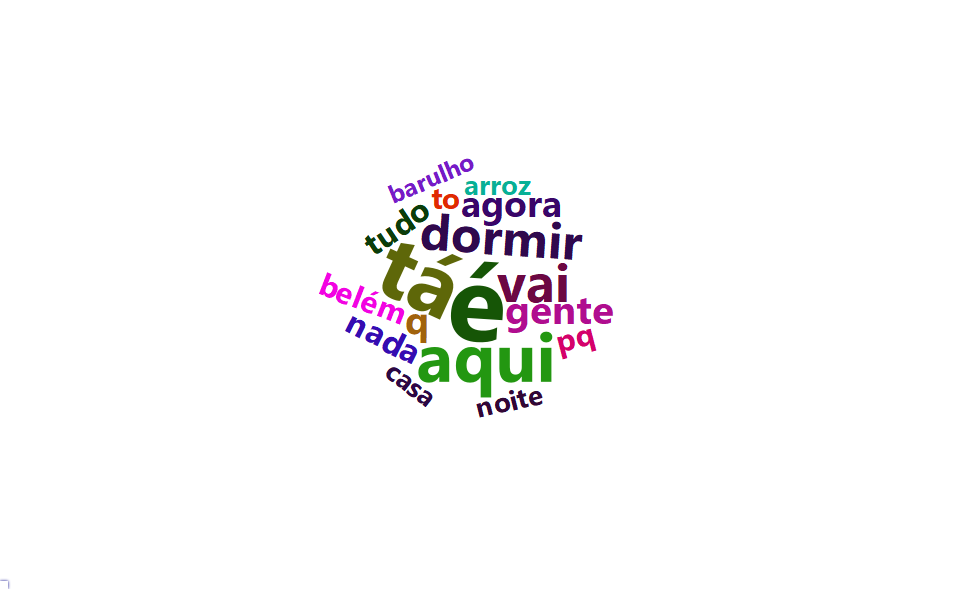

Análise da \#BelemAlagada
================
Rafael Barbosa
09/03/2020

Estava eu olhando [meu twitter](https://twitter.com/RafaelbarbosaS_),
enquanto caía um famoso toró que começou ainda de madrugada, quando vejo
alguns tweets do [Belém Trânsito](https://twitter.com/belemtransito), um
perfil que informa sobre a situação do trânsito em Belém, informando o
caos nas ruas. E para ajudar a população divulgando os vídeos de
alagamento, como
[este](https://twitter.com/caboquisse/status/1236344836057444353?s=20),
[este](https://twitter.com/belemtransito/status/1236429030829801473?s=20)
ou [esta disputa de
natação](https://twitter.com/belemtransito/status/1236429030829801473?s=20)
em um dos canais que têm na cidade.

## Metodologia

Irei utilizar o software R (Rstudio) e pacote `rtweet` para buscar os
tweets associados a “\#BelemAlagada” e “chuva” nos últimos 10 dias. O
período é por conta das condições da API do twitter que só nos permite
fazer a busca neste intervalo de tempo.

## Mão na massa

### Como baixar os dados

Primeiramente para termos acesso a API do twitter para obter estes
dados, devemos ter uma conta e criar um app no twitter (coisa dos
desenvolvedores, nesse caso somos um destes).

O professor Kearney, da universidade de Missouri, ministrou um workshop
em que explicou muito bem como criar um app no twitter e pegar suas keys
o link está [aqui](https://mkearney.github.io/nicar_tworkshop/#1) (em
inglês), assim como as funcionalidades do pacote `rtweet` que também
podem ser acessadas [aqui](https://rtweet.info/).

Como não as keys são pessoais e ligadas a sua conta, não posso mostrar a
minha, correto ?

### Pacotes utilizados

Os pacotes utilizados para a presente análise foram:

1.  rtweet
2.  tidyverse
3.  lubridate
4.  tidytext
5.  ggthemr
6.  abjutils
7.  DT
8.  tm
9.  wordcloud2
10. plotly

A forma de carregar estes pacotes (de algum jeito que vi na web mas não
lembro em qual stackoverflow eu vi na vida, peço desculpas desde já)
pode ser feita assim ó:

``` r
if(!require(tidyverse)) {
  install.packages("tidyverse", dependencies = T);
  require(tidyverse)
}

if(!require(rtweet)) {
  install.packages("rtweet", dependencies = T);
  require(rtweet)
}


if(!require(lubridate)) {
  install.packages("lubridate", dependencies = T);
  require(lubridate)
}


if(!require(tidytext)) {
  install.packages("tidytext", dependencies = T);
  require(tidytext)
}


if(!require(ggthemr)) {
  install.packages("ggthemr", dependencies = T);
  require(ggthemr)
}


if(!require(abjutils)) {
  install.packages("abjutils", dependencies = T);
  require(abjutils)
}


if(!require(kableExtra)) {
  install.packages("kableExtra", dependencies = T);
  require(kableExtra)
}


if(!require(tm)) {
  install.packages("tm", dependencies = T);
  require(tm)
}


if(!require(wordcloud2)) {
  install.packages("wordcloud2", dependencies = T);
  require(wordcloud2)
}


if(!require(plotly)) {
  install.packages("plotly", dependencies = T);
  require(plotly)
}
```

### Configurações adicionais

A `formato_real_graf` vêm do
[stackoverflow](https://pt.stackoverflow.com/questions/216852/adicionar-nota%C3%A7%C3%A3o-de-moeda-em-r)
e `ggthemr` padroniza os gráficos em um tema específico chamado
fresh.

``` r
formato_real_graf <- function(values, nsmall = 0) { #- Formatando o valor como moeda
  values %>%
    as.numeric() %>%
    format(nsmall = nsmall, decimal.mark = ",", big.mark = ".") %>%
    str_trim()
}


ggthemr('fresh')
```

### Baixando os dados via API do twitter

Já com as keys e token criadas e setadas, podemos baixar os dados com a
função `search_tweets`.

``` r
tweets <- search_tweets(q = "chuva OR #BelemAlagada", # Palavras-chave
                        include_rts = F, # Retirar os tweets que foram RT
                        n = 18000, # Número máximo de tweets
                        type = "recent", # Tweets mais recentes
                        geocode = "-1.404242,-48.435261,30km") # Em um raio de 40km do entroncamento
```

Temos um banco de dados com 1305 linhas e 90 colunas, ou seja, 1305
tweets com que continham a \#BelemAlagada ou \#chuva.

### Estrutura dos dados

A estrutura dos dados podem ser verificadas a seguir

``` r
tweets %>% 
  glimpse
```

    ## Observations: 1,305
    ## Variables: 90
    ## $ user_id                 <chr> "782376225440468993", "2730928648", "273092...
    ## $ status_id               <chr> "1254787420270149638", "1254784181290164224...
    ## $ created_at              <dttm> 2020-04-27 15:00:08, 2020-04-27 14:47:16, ...
    ## $ screen_name             <chr> "gatodesalto", "garcia11__", "garcia11__", ...
    ## $ text                    <chr> "me sentindo realizado depois de tomar um b...
    ## $ source                  <chr> "Twitter for Android", "Twitter for Android...
    ## $ display_text_width      <dbl> 74, 14, 18, 11, 14, 40, 34, 14, 37, 116, 13...
    ## $ reply_to_status_id      <chr> NA, NA, NA, NA, NA, NA, NA, NA, NA, NA, "12...
    ## $ reply_to_user_id        <chr> NA, NA, NA, NA, NA, NA, NA, NA, NA, NA, "21...
    ## $ reply_to_screen_name    <chr> NA, NA, NA, NA, NA, NA, NA, NA, NA, NA, "Le...
    ## $ is_quote                <lgl> FALSE, FALSE, FALSE, FALSE, FALSE, FALSE, F...
    ## $ is_retweet              <lgl> FALSE, FALSE, FALSE, FALSE, FALSE, FALSE, F...
    ## $ favorite_count          <int> 0, 2, 0, 0, 0, 0, 0, 0, 0, 0, 0, 0, 0, 1, 1...
    ## $ retweet_count           <int> 0, 0, 0, 0, 0, 0, 0, 0, 0, 0, 0, 0, 0, 0, 0...
    ## $ quote_count             <int> NA, NA, NA, NA, NA, NA, NA, NA, NA, NA, NA,...
    ## $ reply_count             <int> NA, NA, NA, NA, NA, NA, NA, NA, NA, NA, NA,...
    ## $ hashtags                <list> [NA, NA, NA, NA, NA, NA, NA, NA, NA, NA, N...
    ## $ symbols                 <list> [NA, NA, NA, NA, NA, NA, NA, NA, NA, NA, N...
    ## $ urls_url                <list> [NA, NA, NA, NA, NA, NA, NA, NA, NA, NA, N...
    ## $ urls_t.co               <list> [NA, NA, NA, NA, NA, NA, NA, NA, NA, NA, N...
    ## $ urls_expanded_url       <list> [NA, NA, NA, NA, NA, NA, NA, NA, NA, NA, N...
    ## $ media_url               <list> [NA, NA, NA, NA, NA, NA, NA, NA, NA, NA, N...
    ## $ media_t.co              <list> [NA, NA, NA, NA, NA, NA, NA, NA, NA, NA, N...
    ## $ media_expanded_url      <list> [NA, NA, NA, NA, NA, NA, NA, NA, NA, NA, N...
    ## $ media_type              <list> [NA, NA, NA, NA, NA, NA, NA, NA, NA, NA, N...
    ## $ ext_media_url           <list> [NA, NA, NA, NA, NA, NA, NA, NA, NA, NA, N...
    ## $ ext_media_t.co          <list> [NA, NA, NA, NA, NA, NA, NA, NA, NA, NA, N...
    ## $ ext_media_expanded_url  <list> [NA, NA, NA, NA, NA, NA, NA, NA, NA, NA, N...
    ## $ ext_media_type          <chr> NA, NA, NA, NA, NA, NA, NA, NA, NA, NA, NA,...
    ## $ mentions_user_id        <list> [NA, NA, NA, NA, NA, NA, NA, NA, NA, NA, <...
    ## $ mentions_screen_name    <list> [NA, NA, NA, NA, NA, NA, NA, NA, NA, NA, <...
    ## $ lang                    <chr> "pt", "pt", "pt", "pt", "pt", "pt", "pt", "...
    ## $ quoted_status_id        <chr> NA, NA, NA, NA, NA, NA, NA, NA, NA, NA, NA,...
    ## $ quoted_text             <chr> NA, NA, NA, NA, NA, NA, NA, NA, NA, NA, NA,...
    ## $ quoted_created_at       <dttm> NA, NA, NA, NA, NA, NA, NA, NA, NA, NA, NA...
    ## $ quoted_source           <chr> NA, NA, NA, NA, NA, NA, NA, NA, NA, NA, NA,...
    ## $ quoted_favorite_count   <int> NA, NA, NA, NA, NA, NA, NA, NA, NA, NA, NA,...
    ## $ quoted_retweet_count    <int> NA, NA, NA, NA, NA, NA, NA, NA, NA, NA, NA,...
    ## $ quoted_user_id          <chr> NA, NA, NA, NA, NA, NA, NA, NA, NA, NA, NA,...
    ## $ quoted_screen_name      <chr> NA, NA, NA, NA, NA, NA, NA, NA, NA, NA, NA,...
    ## $ quoted_name             <chr> NA, NA, NA, NA, NA, NA, NA, NA, NA, NA, NA,...
    ## $ quoted_followers_count  <int> NA, NA, NA, NA, NA, NA, NA, NA, NA, NA, NA,...
    ## $ quoted_friends_count    <int> NA, NA, NA, NA, NA, NA, NA, NA, NA, NA, NA,...
    ## $ quoted_statuses_count   <int> NA, NA, NA, NA, NA, NA, NA, NA, NA, NA, NA,...
    ## $ quoted_location         <chr> NA, NA, NA, NA, NA, NA, NA, NA, NA, NA, NA,...
    ## $ quoted_description      <chr> NA, NA, NA, NA, NA, NA, NA, NA, NA, NA, NA,...
    ## $ quoted_verified         <lgl> NA, NA, NA, NA, NA, NA, NA, NA, NA, NA, NA,...
    ## $ retweet_status_id       <chr> NA, NA, NA, NA, NA, NA, NA, NA, NA, NA, NA,...
    ## $ retweet_text            <chr> NA, NA, NA, NA, NA, NA, NA, NA, NA, NA, NA,...
    ## $ retweet_created_at      <dttm> NA, NA, NA, NA, NA, NA, NA, NA, NA, NA, NA...
    ## $ retweet_source          <chr> NA, NA, NA, NA, NA, NA, NA, NA, NA, NA, NA,...
    ## $ retweet_favorite_count  <int> NA, NA, NA, NA, NA, NA, NA, NA, NA, NA, NA,...
    ## $ retweet_retweet_count   <int> NA, NA, NA, NA, NA, NA, NA, NA, NA, NA, NA,...
    ## $ retweet_user_id         <chr> NA, NA, NA, NA, NA, NA, NA, NA, NA, NA, NA,...
    ## $ retweet_screen_name     <chr> NA, NA, NA, NA, NA, NA, NA, NA, NA, NA, NA,...
    ## $ retweet_name            <chr> NA, NA, NA, NA, NA, NA, NA, NA, NA, NA, NA,...
    ## $ retweet_followers_count <int> NA, NA, NA, NA, NA, NA, NA, NA, NA, NA, NA,...
    ## $ retweet_friends_count   <int> NA, NA, NA, NA, NA, NA, NA, NA, NA, NA, NA,...
    ## $ retweet_statuses_count  <int> NA, NA, NA, NA, NA, NA, NA, NA, NA, NA, NA,...
    ## $ retweet_location        <chr> NA, NA, NA, NA, NA, NA, NA, NA, NA, NA, NA,...
    ## $ retweet_description     <chr> NA, NA, NA, NA, NA, NA, NA, NA, NA, NA, NA,...
    ## $ retweet_verified        <lgl> NA, NA, NA, NA, NA, NA, NA, NA, NA, NA, NA,...
    ## $ place_url               <chr> NA, NA, NA, NA, NA, NA, NA, NA, NA, NA, NA,...
    ## $ place_name              <chr> NA, NA, NA, NA, NA, NA, NA, NA, NA, NA, NA,...
    ## $ place_full_name         <chr> NA, NA, NA, NA, NA, NA, NA, NA, NA, NA, NA,...
    ## $ place_type              <chr> NA, NA, NA, NA, NA, NA, NA, NA, NA, NA, NA,...
    ## $ country                 <chr> NA, NA, NA, NA, NA, NA, NA, NA, NA, NA, NA,...
    ## $ country_code            <chr> NA, NA, NA, NA, NA, NA, NA, NA, NA, NA, NA,...
    ## $ geo_coords              <list> [<NA, NA>, <NA, NA>, <NA, NA>, <NA, NA>, <...
    ## $ coords_coords           <list> [<NA, NA>, <NA, NA>, <NA, NA>, <NA, NA>, <...
    ## $ bbox_coords             <list> [<NA, NA, NA, NA, NA, NA, NA, NA>, <NA, NA...
    ## $ status_url              <chr> "https://twitter.com/gatodesalto/status/125...
    ## $ name                    <chr> "amorinha", "OBJ", "OBJ", "OBJ", "OBJ", "OB...
    ## $ location                <chr> "belém", "Belém, Brasil", "Belém, Brasil", ...
    ## $ description             <chr> "dedo no cu & terapia", "esse perfil fala d...
    ## $ url                     <chr> NA, "https://t.co/GKPsumZOgZ", "https://t.c...
    ## $ protected               <lgl> FALSE, FALSE, FALSE, FALSE, FALSE, FALSE, F...
    ## $ followers_count         <int> 691, 339, 339, 339, 339, 339, 339, 339, 339...
    ## $ friends_count           <int> 657, 601, 601, 601, 601, 601, 601, 601, 601...
    ## $ listed_count            <int> 0, 0, 0, 0, 0, 0, 0, 0, 0, 0, 10, 0, 1, 1, ...
    ## $ statuses_count          <int> 19048, 25713, 25713, 25713, 25713, 25713, 2...
    ## $ favourites_count        <int> 19123, 44334, 44334, 44334, 44334, 44334, 4...
    ## $ account_created_at      <dttm> 2016-10-02 00:26:43, 2014-08-01 17:56:31, ...
    ## $ verified                <lgl> FALSE, FALSE, FALSE, FALSE, FALSE, FALSE, F...
    ## $ profile_url             <chr> NA, "https://t.co/GKPsumZOgZ", "https://t.c...
    ## $ profile_expanded_url    <chr> NA, "http://Instagram.com/ericlinho", "http...
    ## $ account_lang            <lgl> NA, NA, NA, NA, NA, NA, NA, NA, NA, NA, NA,...
    ## $ profile_banner_url      <chr> "https://pbs.twimg.com/profile_banners/7823...
    ## $ profile_background_url  <chr> "http://abs.twimg.com/images/themes/theme1/...
    ## $ profile_image_url       <chr> "http://pbs.twimg.com/profile_images/125380...

### Modificação dos dados

Podemos verificar que temos uma variável que possui a localização dos
tweets, vamos mostrar algumas
randômicas.

<table class="table table-striped" style="width: auto !important; margin-left: auto; margin-right: auto;">

<thead>

<tr>

<th style="text-align:left;">

location

</th>

</tr>

</thead>

<tbody>

<tr>

<td style="text-align:left;">

Belém, Pará

</td>

</tr>

<tr>

<td style="text-align:left;">

Belém

</td>

</tr>

<tr>

<td style="text-align:left;">

Belém-PA

</td>

</tr>

<tr>

<td style="text-align:left;">

Amazônia/Pará/Belém.

</td>

</tr>

<tr>

<td style="text-align:left;">

Belém, PA

</td>

</tr>

<tr>

<td style="text-align:left;">

Belém, Brasil

</td>

</tr>

<tr>

<td style="text-align:left;">

Belém

</td>

</tr>

<tr>

<td style="text-align:left;">

Belém, Brasil

</td>

</tr>

<tr>

<td style="text-align:left;">

Belém

</td>

</tr>

<tr>

<td style="text-align:left;">

Pará, Brasil

</td>

</tr>

</tbody>

</table>

Podemos perceber que temos regiões como Ananindeua, Belém e Castanhal,
claro que estão a um raio de 30km do entroncamento, devido a isto
aparecem. Mas podemos verificar que Belém possui variações de escrita
(belém, Nárnia - Belém, etc). Logo devemos unificar elas com algumas
modificações.

<table class="table table-striped" style="width: auto !important; margin-left: auto; margin-right: auto;">

<thead>

<tr>

<th style="text-align:left;">

location

</th>

<th style="text-align:left;">

nova\_local

</th>

</tr>

</thead>

<tbody>

<tr>

<td style="text-align:left;">

belem do para

</td>

<td style="text-align:left;">

Belém

</td>

</tr>

<tr>

<td style="text-align:left;">

belem

</td>

<td style="text-align:left;">

Belém

</td>

</tr>

<tr>

<td style="text-align:left;">

ananindeua, brasil

</td>

<td style="text-align:left;">

Ananindeua

</td>

</tr>

<tr>

<td style="text-align:left;">

belem-para

</td>

<td style="text-align:left;">

Belém

</td>

</tr>

<tr>

<td style="text-align:left;">

belem - pa - br

</td>

<td style="text-align:left;">

Belém

</td>

</tr>

<tr>

<td style="text-align:left;">

belem, brasil

</td>

<td style="text-align:left;">

Belém

</td>

</tr>

<tr>

<td style="text-align:left;">

belem, brasil

</td>

<td style="text-align:left;">

Belém

</td>

</tr>

<tr>

<td style="text-align:left;">

belem / para

</td>

<td style="text-align:left;">

Belém

</td>

</tr>

<tr>

<td style="text-align:left;">

belem, brasil

</td>

<td style="text-align:left;">

Belém

</td>

</tr>

<tr>

<td style="text-align:left;">

belem

</td>

<td style="text-align:left;">

Belém

</td>

</tr>

</tbody>

</table>

### Localização dos tweets

Agora que modificamos a variável `nova_local` podemos fazer quais são as
localizações mais frequentes nos
tweets.


Podemos perceber que a maioria (esmagadora) dos tweets relacionadas a
\#BelemAlagada e a chuva era realmente em Belém, mas não podemos tirar o
fato que ocorreu nos outros municípios próximos de
Belém.

### Quantos tweets relacionados por dia (thinking) ?


Podemos verificar há um pico de mais de 2000 tweets relacionados a
\#BelemAlagada ou chuva na região de Belém, durante este período de
chuvas.

### Quais os usuários que mais mencionaram \#BelemAlagada ou chuva

<table class="table table-striped" style="width: auto !important; margin-left: auto; margin-right: auto;">

<thead>

<tr>

<th style="text-align:left;">

Usuário

</th>

<th style="text-align:right;">

Frequência

</th>

</tr>

</thead>

<tbody>

<tr>

<td style="text-align:left;">

aindaecedoamor\_

</td>

<td style="text-align:right;">

8

</td>

</tr>

<tr>

<td style="text-align:left;">

garcia11\_\_

</td>

<td style="text-align:right;">

8

</td>

</tr>

<tr>

<td style="text-align:left;">

chrisvier

</td>

<td style="text-align:right;">

6

</td>

</tr>

<tr>

<td style="text-align:left;">

leticiaag\_\_

</td>

<td style="text-align:right;">

5

</td>

</tr>

<tr>

<td style="text-align:left;">

twerklopez

</td>

<td style="text-align:right;">

5

</td>

</tr>

<tr>

<td style="text-align:left;">

\_\_\_aquariano

</td>

<td style="text-align:right;">

4

</td>

</tr>

<tr>

<td style="text-align:left;">

\_CGabs

</td>

<td style="text-align:right;">

4

</td>

</tr>

<tr>

<td style="text-align:left;">

airamvit\_

</td>

<td style="text-align:right;">

4

</td>

</tr>

<tr>

<td style="text-align:left;">

bryandernie

</td>

<td style="text-align:right;">

4

</td>

</tr>

<tr>

<td style="text-align:left;">

giovannavillar

</td>

<td style="text-align:right;">

4

</td>

</tr>

</tbody>

</table>

Temos que mencionar o grande trabalho do [Belém
Trânsito](https://twitter.com/belemtransito) que compartilha grandes
informações com todo o twitter sobre a situação de Belém, não somente
neste período de chuvas, mas em literalmente qualquer problema, vai de
chuva a greve de ônibus. Inclusive, se você comentou algo sobre chuva o
\#BelemAlagada, veja se seu @ não está aí com a quantidade ;)

### Quais as palavras mais utilizadas com a \#BelemAlagada ou chuva ?

Inicialmente temos que passar por um processo de limpeza dos tweets e
remover pontuações, espaços em brancos, etc, para que fique somente as
palavras corretas para que podemos associar a um dicionário. A função
utilizada foi a `cleanTweets` do [Fellipe
Gomes](https://gomesfellipe.github.io/) que pode ser encontrada
[aqui](https://github.com/gomesfellipe/functions/blob/master/cleanTweets.R)
com algumas modificações.

Posteriormente utilizar a função `unnest_tokens` do pacote *tidytext*
para que ele separe cada palavra por linha, fazendo com o que banco
aumente, apesar de
tudo.

<table class="table table-striped" style="width: auto !important; margin-left: auto; margin-right: auto;">

<thead>

<tr>

<th style="text-align:left;">

word

</th>

</tr>

</thead>

<tbody>

<tr>

<td style="text-align:left;">

me

</td>

</tr>

<tr>

<td style="text-align:left;">

sentindo

</td>

</tr>

<tr>

<td style="text-align:left;">

realizado

</td>

</tr>

<tr>

<td style="text-align:left;">

depois

</td>

</tr>

<tr>

<td style="text-align:left;">

de

</td>

</tr>

<tr>

<td style="text-align:left;">

tomar

</td>

</tr>

<tr>

<td style="text-align:left;">

um

</td>

</tr>

<tr>

<td style="text-align:left;">

banho

</td>

</tr>

<tr>

<td style="text-align:left;">

de

</td>

</tr>

<tr>

<td style="text-align:left;">

chuva

</td>

</tr>

</tbody>

</table>

Agora iremos buscar o dicionário (ou stop words) do pacote `tm`, fazer
um [anti\_join](https://dplyr.tidyverse.org/reference/join.html),
retorna todas as linhas de x onde não há valores correspondentes em y,
mantendo apenas as colunas de x e filtras pelas palavras que não é
“Belém”, já que sabemos que ela faz parte da pesquisa
inicial.

<table class="table table-striped" style="width: auto !important; margin-left: auto; margin-right: auto;">

<thead>

<tr>

<th style="text-align:left;">

word

</th>

<th style="text-align:right;">

n

</th>

</tr>

</thead>

<tbody>

<tr>

<td style="text-align:left;">

é

</td>

<td style="text-align:right;">

179

</td>

</tr>

<tr>

<td style="text-align:left;">

tá

</td>

<td style="text-align:right;">

146

</td>

</tr>

<tr>

<td style="text-align:left;">

aqui

</td>

<td style="text-align:right;">

113

</td>

</tr>

<tr>

<td style="text-align:left;">

vai

</td>

<td style="text-align:right;">

88

</td>

</tr>

<tr>

<td style="text-align:left;">

dormir

</td>

<td style="text-align:right;">

83

</td>

</tr>

<tr>

<td style="text-align:left;">

gente

</td>

<td style="text-align:right;">

66

</td>

</tr>

<tr>

<td style="text-align:left;">

q

</td>

<td style="text-align:right;">

65

</td>

</tr>

<tr>

<td style="text-align:left;">

agora

</td>

<td style="text-align:right;">

62

</td>

</tr>

<tr>

<td style="text-align:left;">

nada

</td>

<td style="text-align:right;">

57

</td>

</tr>

<tr>

<td style="text-align:left;">

tudo

</td>

<td style="text-align:right;">

55

</td>

</tr>

</tbody>

</table>

E agora podemos ver em uma nuvem de palavras, que talvez seja a
visualização de dados mais adequada, com o pacote `wordcloud2`.

``` r
wordcloud2(data = banco_freq, size = 0.6,
           shape = "oval",
           rotateRatio = 0.5,
           ellipticity = 0.9, color = "random-dark")
```


